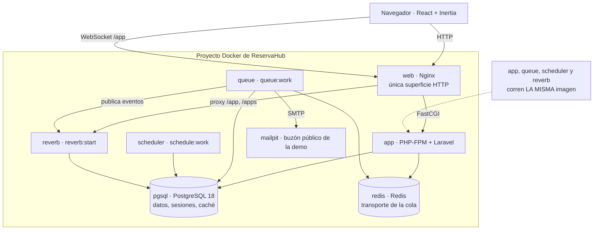
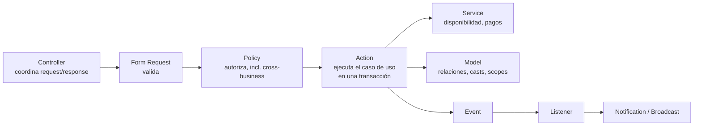

# ReservaHub

SaaS de reservas por turnos, multi-tenant, en español, para negocios que trabajan con franjas
horarias.

[](https://github.com/Gonzalez-Luciano/reservahub/actions/workflows/ci.yml)

## El problema

Peluquerías, gimnasios, talleres, profesores particulares, estudios: cualquier negocio que vende
tiempo en franjas horarias necesita una regla simple y difícil de romper — que dos personas no
puedan reservar el mismo turno con el mismo empleado. ReservaHub resuelve eso de punta a punta:
disponibilidad calculada a partir del horario real del empleado, prevención de solapamientos,
confirmación por seña, recordatorios automáticos y un panel en tiempo real para el negocio.

## Aviso de estado

Proyecto de aprendizaje y portfolio. Los pagos son **simulados** — no hay ningún cobro real, ninguna
pasarela real y ninguna tarjeta involucrada. El objetivo es mostrar una implementación completa de
Laravel (dominio, API, colas, tiempo real, Docker, CI) de punta a punta, no operar un negocio real.

## Stack

- **Backend:** Laravel 13 · PHP 8.5
- **Frontend:** Inertia 3 · React 19 · Vite 8 · Tailwind 4 — sin librería de componentes, sistema de
  diseño propio
- **Datos:** PostgreSQL 18 · Redis (transporte de cola)
- **Tiempo real:** Laravel Reverb
- **Infraestructura:** Docker (Sail en desarrollo, Nginx + PHP-FPM en producción)
- **Tests:** PHPUnit

## Arquitectura

Un solo runtime de aplicación (Laravel + Inertia + React compilado a `public/build`, sin Node en
producción), acompañado de procesos de cola, scheduler y tiempo real que corren la misma imagen:



Dentro de `app`, cada request atraviesa la misma cadena de capas:



## Roles

Cuatro roles fijos en una columna `role` de `users`: `owner`, `admin`, `employee`, `customer`. Sin
sistema de permisos granular por ahora — es una decisión deliberada para no sobre-diseñar antes de
necesitarlo.

## Multi-tenancy

Toda tabla propiedad de un negocio lleva `business_id`. Un global scope (`BusinessScope`) filtra
automáticamente por el negocio del usuario autenticado; el middleware `EnsureBusinessContext`
resuelve y fija ese negocio en el request; las Policies son la última barrera contra el acceso
cruzado (`employee` de un negocio no puede leer ni modificar datos de otro). El aislamiento entre
negocios es un objetivo de test explícito en toda la suite, no un efecto colateral.

## Servicios

Cada servicio define su propia duración, precio, `buffer_minutes` (colchón después del turno) y una
seña opcional (`deposit_amount`). La duración de una reserva **siempre** sale del servicio — nunca
la envía el cliente.

## Disponibilidad

`App\Services\AvailabilityService` es el motor central: dado un negocio, un servicio, un empleado y
una fecha, combina el horario semanal del empleado, resta pausas (`schedule_breaks`), licencias
(`time_offs`), feriados del negocio y reservas existentes, todo evaluado en la zona horaria del
negocio, y devuelve los huecos libres. Es un servicio de dominio puro, con tests unitarios
independientes de HTTP.

## Prevención de solapamientos

Un mismo empleado no puede tener dos reservas que se superpongan. La disponibilidad se calcula
contra las reservas reales del empleado, no contra un calendario aparte.

## Concurrencia

Calcular disponibilidad en la capa de validación no alcanza: dos requests simultáneos podrían leer
el mismo hueco libre y crear dos reservas para el mismo empleado. Por eso la disponibilidad se
**re-valida dentro de la transacción** que crea la reserva, protegida por
`pg_advisory_xact_lock` por empleado (`App\Actions\Bookings\CreateBooking`, línea 53) — un segundo
request para el mismo empleado espera al primero antes de leer el estado. Hay un test de
concurrencia dedicado que dispara creaciones simultáneas contra el mismo slot.

## Reservas

Una reserva pasa por los estados `pending`, `confirmed`, `cancelled`, `completed` y `no_show`. Cada
transición queda registrada en `booking_status_histories`. Los clientes no pueden cancelar pasado el
límite configurado por el negocio (`cancellation_hours`).

## Pagos simulados

Un único proveedor de pagos, **simulado**, detrás del contrato `PaymentGateway`
(`App\Services\Payments\Simulated\SimulatedPaymentGateway`). El estado del proveedor vive en su
propia tabla, `simulated_provider_payments`, separada de `payments`: la reconciliación
(`payments:reconcile`) compara dos almacenes de verdad independientes, tal como lo haría contra un
proveedor real.

## Webhooks idempotentes

Un webhook repetido nunca duplica un pago ni confirma una reserva dos veces. La identidad del evento
es `unique (provider, external_event_id)`; el procesamiento reclama la fila con `for update`, y el
efecto (aplicar el resultado del pago) junto con la marca de "procesado" ocurren en la misma
transacción. `App\Actions\Payments\ApplyPaymentResult` es el único camino que aplica un resultado de
pago, y `ConfirmBooking` el único que confirma una reserva — tanto el endpoint HTTP del webhook como
`payments:reconcile` convergen ahí.

## Cola

Los jobs corren sobre Redis (`QUEUE_CONNECTION=redis`), consumidos por:

```bash
php artisan queue:work --tries=3 --max-time=3600
```

## Scheduler

Un proceso `schedule:work` dispara, entre otros:

- `bookings:send-reminders` — recordatorios de 24h/2h, sin duplicados.
- `bookings:expire-unpaid` — cancela reservas cuya ventana de pago venció.
- `payments:reconcile` — compara el estado local contra el del proveedor simulado.
- `demo:restore-access` — restaura credenciales de demo, todos los días.
- `demo:reset` — reinicia el dataset completo de demo, todos los lunes.

## Tiempo real

Laravel Reverb entrega actualizaciones en vivo por un canal privado por negocio
(`private-business.{businessId}`). `App\Events\Broadcasting\BookingChanged` es el **único** evento
de broadcast — no hay eventos de WebSocket para pagos; un pago aprobado llega a la pantalla como
cualquier confirmación de reserva. El payload es una pista (`{booking_id, change, updated_at}`), no
datos: el cliente recarga el estado canónico con `router.reload()`, así que las Policies siguen
siendo la autoridad.

## Docker

- **Desarrollo:** `compose.yaml`, basado en Laravel Sail (`laravel.test`, `pgsql`, `redis`,
  `mailpit`, `queue`, `scheduler`, `reverb`).
- **Producción:** `compose.production.yaml` + `docker/production/` — Nginx como única superficie
  HTTP, PHP-FPM aparte, sin ningún proceso Node en runtime (los assets se compilan en build time).

## CI

El workflow `ci` corre tests y formato en cada push y pull request. Ver el badge arriba o
`.github/workflows/ci.yml`.

## API

REST bajo `/api`, sin versión, autenticada con tokens personales de Sanctum. Toda respuesta sigue el
mismo envelope:

```json
{ "success": true, "data": {}, "message": "", "errors": null }
```

Documentación completa, con ejemplos de cada endpoint, en [`docs/api.md`](docs/api.md).

## Demo pública

El repositorio está preparado para operar como una demo pública descartable, aunque **todavía no
hay ningún despliegue real** — la URL se agrega en un commit posterior, cuando el deployment exista.
El contrato, ya implementado, es:

- **Dataset semanal:** el domingo a la noche / lunes 00:00 (`America/Argentina/Buenos_Aires`) se
  reinicia toda la base de datos al estado sembrado por `DemoSeeder` (`demo:reset`).
- **Credenciales diarias:** todos los días a las 00:00 se restauran las contraseñas de las cuentas
  de demo (`demo:restore-access`), para que una sesión de un visitante anterior no deje contraseñas
  cambiadas de un día para el otro.
- **Mailpit público, a propósito:** el buzón que captura los correos de la demo (verificación,
  reset de contraseña, invitaciones, notificaciones de reserva) es visible para cualquier
  visitante, sin aislamiento entre ellos. Es una decisión consciente del modelo de demo compartida,
  documentada en [`docs/DEPLOYMENT_HANDOFF.md`](docs/DEPLOYMENT_HANDOFF.md) — no un descuido.
- **Contraseñas descartables:** ninguna contraseña de la demo es secreta ni protege datos reales; el
  reinicio diario y semanal es la barrera de seguridad, no el aislamiento del buzón.

## Instalación de desarrollo

El proyecto corre íntegramente en Docker vía Laravel Sail — no hay un camino nativo funcional,
porque `.env` apunta a los nombres de servicio de Docker (`pgsql`, `redis`, `mailpit`).

> **`vendor/bin/sail` no funciona en Git Bash sobre Windows** (falla con
> `Unsupported operating system [MINGW64_NT-...]`). Usar `docker compose` directamente, con
> variables `WWWUSER`/`WWWGROUP` dummy — sin ellas Sail muestra warnings inofensivos de "variable
> not set" pero los contenedores igual arrancan bien.

```bash
WWWUSER=1000 WWWGROUP=1000 docker compose up -d
docker compose exec laravel.test php artisan migrate:fresh --force
docker compose exec laravel.test php artisan test
docker compose exec laravel.test vendor/bin/pint --test
```

Para poblar el dataset de demo (negocios, servicios, empleados, clientes y reservas de ejemplo):

```bash
docker compose exec laravel.test php artisan db:seed --class=DemoSeeder
```

El frontend usa **pnpm**, no npm:

```bash
docker compose exec laravel.test bash -lc "pnpm install --frozen-lockfile && pnpm build"
```

## Tests

```bash
docker compose exec laravel.test php artisan test
docker compose exec laravel.test vendor/bin/pint --test
```

## Documentación

- [`docs/api.md`](docs/api.md) — referencia de la API REST, con ejemplos de cada endpoint.
- [`docs/DEPLOYMENT_HANDOFF.md`](docs/DEPLOYMENT_HANDOFF.md) — contrato de aplicación para quien
  opere el servidor de producción (procesos, variables de entorno, health checks, contrato de
  reinicio de la demo).
- [`docs/RELEASE.md`](docs/RELEASE.md) — procedimiento de release, esquema de `v1.0.0` y
  rollback por versión de imagen.
- [`01-reservahub.md`](01-reservahub.md) — especificación completa del proyecto, autoridad sobre
  cualquier comportamiento no cubierto por los documentos anteriores.
