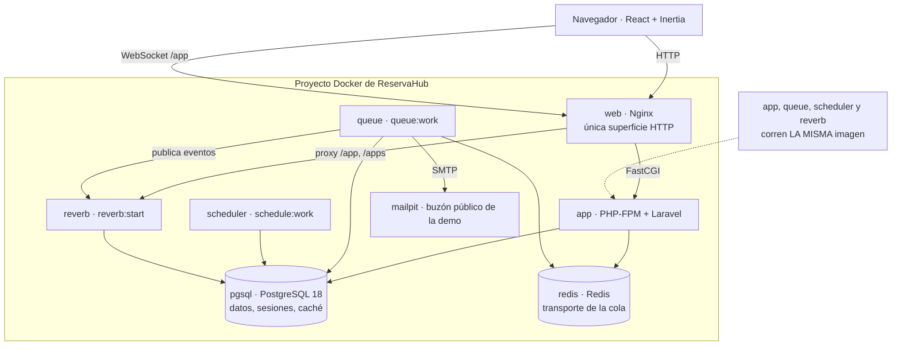
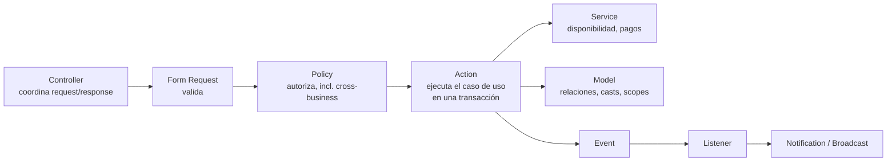

# Fase 12 — Release readiness, GitHub y preparación para producción · Plan de implementación

> **For agentic workers:** REQUIRED SUB-SKILL: Use superpowers:subagent-driven-development (recommended) or superpowers:executing-plans to implement this plan task-by-task. Steps use checkbox (`- [ ]`) syntax for tracking.

**Goal:** Dejar ReservaHub como una release pública reproducible — repositorio GitHub público, CI, imágenes GHCR inmutables, runtime productivo Nginx + PHP-FPM sin Sail y sin `artisan serve`, comandos de demo guardados, contrato de entorno completo y `v1.0.0` — sin tocar el VPS real ni Cloudflare.

**Architecture:** Se agrega una **segunda topología** al repositorio, independiente de la de desarrollo. `compose.yaml` (Sail) no se toca. Nace `docker/production/` con una imagen PHP-FPM multi-stage (`composer` → `node/pnpm` → `php:8.5-fpm-alpine`) reutilizada sin cambios por `app`, `queue`, `scheduler` y `reverb` (solo cambia el comando), más una imagen `web` (`nginx:alpine`) que es la única superficie HTTP del proyecto y hace de gateway tanto de Laravel como del WebSocket de Reverb. En la aplicación se agregan exactamente dos comandos (`demo:reset`, `demo:restore-access`) sobre un `config/demo.php` nuevo, y el contador del frontend pasa de diario a semanal. Cero dependencias nuevas de runtime, cero cambios en Fase 9 (pagos) y Fase 10 (Reverb).

**Tech Stack:** Laravel 13 · PHP 8.5 · Inertia 3 · React 19 · Vite 8 · pnpm · PostgreSQL 18 · Redis · Reverb · Nginx · PHP-FPM · Docker · GitHub Actions · GHCR · PHPUnit

**Spec:** `01-reservahub.md` §12 (Fase 12, líneas 701–2564). No existe un documento aparte en `docs/superpowers/specs/` para esta fase: la especificación aprobada vive en el roadmap.

---

## Global Constraints

Toda tarea hereda esta sección. Los valores son literales de la spec o hechos verificados contra el repositorio.

### Entorno de trabajo

- Todo el trabajo ocurre en el worktree `feat/phase-12-release-readiness`, en
  `C:\Users\lucho\Desktop\Proyectos-Laravel\reservahub\.claude\worktrees\feat+phase-12-release-readiness`.
- **Stack de desarrollo del worktree** (Tarea 0 lo levanta): app `http://localhost:8180`,
  Mailpit `http://localhost:8026`, Reverb puerto `8081`, Postgres `54320`, Redis `63790`, Vite `5273`.
- **Stack productivo local** (Tarea 11 lo levanta), puertos distintos a propósito para poder correr
  ambos a la vez: web `http://localhost:8280`, Mailpit `http://localhost:8027`. Postgres y Redis
  **sin puerto publicado**.
- Comandos canónicos de desarrollo:
  - Tests: `docker compose exec -T laravel.test php artisan test`
  - Test dirigido: `docker compose exec -T laravel.test php artisan test --filter=NombreDelTest`
  - Formato: `docker compose exec -T laravel.test vendor/bin/pint --test`
  - Arreglar formato: `docker compose exec -T laravel.test vendor/bin/pint`
  - Build frontend: `docker compose exec -T laravel.test bash -lc "pnpm build"`
- `vendor/bin/sail` **no funciona** en Git Bash sobre Windows. Siempre `docker compose` directo con
  `WWWUSER=1000 WWWGROUP=1000` por delante en los `up`.
- `MSYS_NO_PATHCONV=1` es obligatorio en Git Bash para cualquier `docker run`/`docker exec` cuyo
  argumento sea una ruta absoluta estilo Unix (`/var/www/html`, `/mailpit`). Sin eso Git Bash la
  reescribe a `C:/Program Files/Git/...` y Docker la rechaza.

### Reglas de producto que no se pueden romper

- **Gestor de paquetes JS: pnpm.** Nunca `npm`. No existe `package-lock.json`.
- **Cero dependencias nuevas de runtime.** Prohibido instalar **Playwright, Cypress, Vitest, Jest**
  o cualquier framework E2E. Prohibido Octane, FrankenPHP, RoadRunner, Grafana, Prometheus,
  Uptime Kuma, Coolify.
- **`artisan serve` no se usa en producción.** Ni Sail. `compose.yaml` sigue siendo exclusivamente
  desarrollo y **no se modifica en toda la fase**.
- **No hay proceso Node en producción.** `public/build` viaja dentro de la imagen.
- **Una sola imagen Laravel** para `app`, `queue`, `scheduler` y `reverb`. Solo cambia el comando.
- **Invariantes Fase 9 (pagos):** `ApplyPaymentResult` sigue siendo el único camino que aplica un
  resultado del proveedor y `ConfirmBooking` el único que confirma. `ProcessPaymentWebhook` sigue
  siendo el único borde de procesamiento. Orden de bloqueo `webhook_events → bookings → payments`.
  Ningún comando nuevo muta `Booking` ni `Payment` por su cuenta.
- **Invariantes Fase 10 (Reverb):** `BookingChanged` sigue siendo el **único** evento bajo
  `app/Events/Broadcasting/` (hay un test que lo verifica). Canal único
  `private-business.{businessId}`. Payload `{booking_id, change, updated_at}`. Sin tiempo real para
  clientes. No se toca `routes/channels.php`, ni `BroadcastBookingChange`, ni `BookingsRealtime.jsx`.
- **Nada de deployment real:** no se toca OVH, DNS, Cloudflare, SSH, firewall, systemd, cron del
  host, ni `/srv`. No se agrega ninguna GitHub Action que haga SSH al servidor.
- **GitHub sin actividad ficticia:** prohibido crear issues o PRs históricos falsos.
- **Ningún secreto real** entra al repositorio ni a una imagen.

### Contrato de reinicio de la demo (nuevo, reemplaza al diario)

```text
SEMANAL   lunes 00:00 America/Argentina/Buenos_Aires  → demo:reset
DIARIO    00:00       America/Argentina/Buenos_Aires  → demo:restore-access
DIARIO    00:00       America/Argentina/Buenos_Aires  → limpiar Mailpit (operaciones)
```

- El countdown del frontend representa **el próximo lunes 00:00**, y **solo ese**. No se agrega un
  segundo contador para las credenciales.
- Accesibilidad del contador, conservada de Fase 11: sin segundos visibles, sin `aria-live`, sin
  pulso, sin animación, numerales tabulares, sin layout shift, sin afectar el foco, sin reload.
  Sigue siendo cliente puro: **sin API de reset, sin polling, sin WebSocket para el contador**.
- `demo:reset` **nunca** llama a Mailpit: es otro servicio, y su limpieza es de operaciones.

### Hechos verificados contra el repositorio (no volver a asumirlos)

| Hecho | Evidencia |
|---|---|
| No existe remote `origin` | `git remote -v` vacío |
| `.env` nunca estuvo versionado | `git log --all -- .env` vacío |
| No existe `.github/` | verificado |
| No existe ningún `Dockerfile` fuera de `vendor/` | `find -name "Dockerfile*"` |
| PHP en runtime es **8.5.9**, con OPcache **On** | `php -v`, `php -i` en el contenedor |
| Extensiones presentes hoy: `pdo_pgsql`, `pgsql`, `redis`, `pcntl`, `posix`, `sockets`, `bcmath`, `intl`, `mbstring`, `zip` | `php -m` |
| `laravel/reverb ^1.11` no declara ninguna `ext-` propia | `composer show laravel/reverb` |
| **Reverb responde `GET /up` con 200** en su propio puerto | `curl localhost:8080/up` |
| Reverb responde 404 en `/` y `/health`, y 401 en `/apps/...` sin firma | `curl` |
| Mailpit expone `/readyz`, `/livez` y `/api/v1/info` con 200, y su imagen ya trae healthcheck `["CMD","/mailpit","readyz"]` | `curl`, `docker inspect` |
| `php:8.5-fpm-alpine`, `nginx:alpine`, `node:24-alpine`, `composer:2` existen en el registry | `docker manifest inspect` |
| `DatabaseSeeder` **llama a `DemoSeeder`** y además crea `test@example.com` | `DatabaseSeeder.php:23` |
| Las colas viven en **Redis**, no en la tabla `jobs` | `QUEUE_CONNECTION=redis` |
| Los locks de `withoutOverlapping` viven en la tabla `cache_locks` de Postgres | `CACHE_STORE=database`, `0001_01_01_000001_create_cache_table.php` |
| Ya existe el patrón `pg_advisory_xact_lock` | `CreateBooking.php:53` |
| El registro público **sí puede crear negocios** | `RegisteredUserController::store` → `RegisterBusinessOwner` |
| `businesses.slug` **no es editable** | `UpdateBusinessSettings.php:10` |
| `UserAccessRevoker::revoke()` **lanza excepción** si `SESSION_DRIVER !== 'database'` | `UserAccessRevoker.php:33` |
| `phpunit.xml` fija `SESSION_DRIVER=array` | `phpunit.xml` |
| La contraseña demo `'password'` está hardcodeada 5× en `DemoSeeder.php` y 1× en `ComoFunciona.jsx:184` | `grep` |
| Baseline en `5ce39a4`: **591 tests, 1969 aserciones, 0 fallos**; Pint PASS 365 archivos; `composer validate --strict` válido | ejecutado |
| `gh` CLI **no está instalado** | `gh --version` |

### Dominio previsto (decisión aprobada, §12.1)

```text
reservahub.lucianogonzalez.dev        aplicación
mail.reservahub.lucianogonzalez.dev   Mailpit público
```

Es el **único** lugar donde un hostname puede aparecer en el repositorio: como *default* de un
build arg de Vite, porque las variables `VITE_*` se compilan dentro del bundle. No entra en
`compose.production.yaml`, ni en la config de Nginx, ni en ningún `.env` versionado.

---

## Estructura de archivos

### Se crean

| Archivo | Responsabilidad |
|---|---|
| `config/demo.php` | Fuente canónica del modo demo: flag, fingerprint de base, contraseña pública, slugs y cuentas del dataset |
| `app/Console/Commands/Demo/DemoResetCommand.php` | `demo:reset` — guardas, lock, purga de cola, `migrate:fresh` + `DemoSeeder` |
| `app/Console/Commands/Demo/DemoRestoreAccessCommand.php` | `demo:restore-access` — devuelve las credenciales publicadas a su estado canónico, sin tocar datos funcionales |
| `app/Support/DemoEnvironment.php` | Las guardas compartidas por ambos comandos, testeables sin HTTP |
| `app/Support/DemoResetLock.php` | Mutex de `demo:reset`: advisory lock de sesión de PostgreSQL, que sobrevive al `migrate:fresh` |
| `app/Exceptions/DemoGuardException.php` | Excepción de guarda del modo demo |
| `.dockerignore` | Evita que `vendor/`, `node_modules/`, `.git/` y `.env` entren al build context |
| `docker/production/app.Dockerfile` | Imagen Laravel productiva multi-stage (única, reutilizada por 4 procesos) |
| `docker/production/web.Dockerfile` | Imagen Nginx con la config y los assets estáticos |
| `docker/production/nginx/nginx.conf` | Config global de Nginx (workers, logs a stdout) |
| `docker/production/nginx/default.conf` | Server block: front controller Laravel + gateway WebSocket de Reverb |
| `docker/production/php/php.ini` | Límites de PHP y OPcache productivo |
| `docker/production/php/www.conf` | Pool PHP-FPM explícito y conservador |
| `docker/production/php/entrypoint.sh` | Espera de dependencias + `php-fpm` en foreground |
| `compose.production.yaml` | Topología productiva portable: 8 servicios, healthchecks, restart policies |
| `.env.production.example` | Plantilla del contrato productivo, sin un solo valor real |
| `.github/workflows/ci.yml` | CI en `push` y `pull_request` |
| `.github/workflows/release.yml` | Publicación de imágenes a GHCR en tag `v*` |
| `scripts/smoke.sh` | Smoke portable parametrizable por host |
| `LICENSE` | MIT, a nombre del autor |
| `docs/RELEASE.md` | Procedimiento de release, rollback y schema de `v1.0.0` |
| `tests/Feature/Console/DemoResetCommandTest.php` | Tests de `demo:reset` |
| `tests/Feature/Console/DemoRestoreAccessCommandTest.php` | Tests de `demo:restore-access` |
| `tests/Unit/Support/DemoEnvironmentTest.php` | Tests de las guardas |
| `tests/Unit/Support/DemoConfigTest.php` | Contraseña canónica y anti-deriva entre config y seeder |
| `docs/audits/2026-08-25-git-history-audit.md` | Conclusión explícita de la auditoría previa a publicar |
| `docs/audits/2026-08-25-dependency-audit.md` | `composer audit` / `pnpm audit` y la decisión por advisory |
| `docs/screenshots/*.webp` | Capturas post-Fase 11 para el README |

### Se modifican

| Archivo | Cambio |
|---|---|
| `database/seeders/DemoSeeder.php` | La contraseña deja de estar hardcodeada 5× y sale de `config('demo.password')` |
| `resources/js/Components/domain/DemoResetCountdown.jsx` | De "próximo 00:00" a "próximo lunes 00:00" |
| `resources/js/Components/DemoStrip.jsx` | Copy semanal + credenciales diarias |
| `resources/js/Pages/ComoFunciona.jsx` | Copy semanal, y la contraseña sale de una prop del servidor |
| `app/Http/Controllers/ComoFuncionaController.php` | Expone la contraseña demo y las cuentas como props |
| `.env.example` | Agrega el bloque de modo demo y las variables que faltaban |
| `composer.json` | Metadatos del proyecto, constraint de PHP, `scripts` sin `npm` ni `artisan serve` |
| `README.md` | Reemplazo completo del boilerplate de Laravel |
| `docs/DEPLOYMENT_HANDOFF.md` | Reescritura al modelo VPS multiproyecto |
| `01-reservahub.md` | Tabla de estado y referencias al reset diario |
| `CLAUDE.md` | Frontera de responsabilidad, entorno productivo y contrato de reset |

### No se tocan (verificación explícita al final)

`compose.yaml` · `app/Actions/Payments/**` · `app/Services/Payments/**` · `app/Events/Broadcasting/**` ·
`app/Listeners/BroadcastBookingChange.php` · `routes/channels.php` · `resources/js/Components/BookingsRealtime.jsx`

---

## Orden de dependencias

```text
 0 bootstrap del worktree
 1 auditoría de historial Git      GATE: bloquea la Tarea 21, no las intermedias
 2 identidad del repositorio
 3 config/demo.php + contraseña canónica
 4 guardas del entorno demo         ← 3
 5 demo:restore-access              ← 3, 4
 6 demo:reset                       ← 3, 4
 7 countdown semanal                ← 3
 8 imagen productiva de Laravel
 9 Nginx + gateway de Reverb        ← 8
10 contrato de entorno productivo
11 compose productivo portable      ← 8, 9, 10
12 verificación local del stack     ← 11
13 smoke portable                   ← 12
14 CI                               ← 8, 9, 11
15 release GHCR                     ← 8, 9, 14
16 auditoría de dependencias
17 README                           ← 2..16
18 handoff                          ← 8..16
19 procedimiento de release/rollback ← 15
20 barrido documental               ← 7, 17, 18, 19
21 publicación en GitHub            ← 1 (GATE), 14, 20
22 release v1.0.0                   ← todas
```

Las Tareas 8–10 no dependen de las 3–7: si se ejecutan con agentes en paralelo, el runtime productivo
y los comandos de demo son ramas independientes que solo se juntan en la Tarea 12.

---

## Task 0: Bootstrap del worktree y baseline

El worktree se creó desde `main@5ce39a4` pero arranca **sin** `.env`, `vendor/`, `node_modules/` ni
`public/build`: los cuatro están en `.gitignore` y `git worktree add` no los trae. Dos ausencias
muerden de forma no obvia y esta tarea existe para evitarlas:

- Sin `vendor/`, `docker compose` **ni siquiera puede construir**: el build context de `laravel.test`
  es `./vendor/laravel/sail/runtimes/8.5`, que todavía no existe.
- Sin `public/build`, `@vite` no resuelve su manifest y **toda página Inertia falla**. La suite
  reporta ~28 fallos con `Not a valid Inertia response` que parecen bugs de aplicación y no lo son.

**Files:**
- Create: `.env` (no versionado)

**Interfaces:**
- Produces: un stack de desarrollo funcionando en los puertos del worktree, y un baseline verde
  contra el que comparar todo lo demás.

- [ ] **Step 1: Copiar el `.env` del checkout principal**

```bash
cp ../../../.env .env
```

- [ ] **Step 2: Reemplazar los puertos por los del worktree**

Editar `.env` y dejar exactamente estos valores (todos ≤ 65535, ninguno colisiona con el stack
principal, que usa 80/5432/6379/1025/8025/5173/8080):

```dotenv
APP_URL=http://localhost:8180
APP_PORT=8180
FORWARD_DB_PORT=54320
FORWARD_REDIS_PORT=63790
FORWARD_MAILPIT_PORT=10250
FORWARD_MAILPIT_DASHBOARD_PORT=8026
VITE_PORT=5273
FORWARD_REVERB_PORT=8081
VITE_REVERB_PORT=8081
```

Verificar además que `DB_HOST=pgsql` (no `127.0.0.1`: no hay ruta nativa que funcione) y que
`REDIS_HOST=redis` y `MAIL_HOST=mailpit` siguen apuntando a nombres de servicio.

`VITE_REVERB_PORT` tiene que coincidir con `FORWARD_REVERB_PORT` porque se compila dentro del bundle.

- [ ] **Step 3: Instalar dependencias de Composer rompiendo el huevo y la gallina**

Se corre Composer dentro de la imagen Sail ya construida del checkout principal, porque el worktree
todavía no tiene `vendor/` para poder construir la suya:

```bash
MSYS_NO_PATHCONV=1 docker run --rm -u root \
  -v "$(pwd -W):/var/www/html" -w /var/www/html \
  --entrypoint composer sail-8.5/app:latest install --no-interaction
```

- [ ] **Step 4: Levantar el stack del worktree**

```bash
WWWUSER=1000 WWWGROUP=1000 docker compose up -d
```

Expected: 7 contenedores con prefijo `feat+phase-12-release-readiness-`.

- [ ] **Step 5: Migrar y construir el frontend**

```bash
docker compose exec -T laravel.test php artisan migrate:fresh --force
docker compose exec -T laravel.test bash -lc "pnpm install --frozen-lockfile && rm -f public/hot && pnpm build"
```

`rm -f public/hot` no es opcional: si alguna vez corrió un `pnpm dev` nativo contra este directorio,
`@vite` emitiría scripts apuntando a un servidor Vite muerto y la página quedaría en blanco.

- [ ] **Step 6: Baseline**

```bash
docker compose exec -T laravel.test php artisan test
docker compose exec -T laravel.test vendor/bin/pint --test
```

Expected: `591 passed`, `0 failures`; Pint `PASS`. El **primer** `php artisan test` después de un
`up -d` tarda ~10× más que los siguientes (~600 s contra ~70 s): es arranque en frío de Postgres más
opcache frío, no una suite colgada.

- [ ] **Step 7: Confirmar que no hay nada que commitear**

```bash
git status --short
```

Expected: vacío. `.env`, `vendor/`, `node_modules/` y `public/build` están ignorados.

---

## Task 1: Auditoría de historial Git previa a la publicación

**GATE.** Esta tarea no escribe código: produce una conclusión explícita `SAFE TO PUBLISH` o una
lista de bloqueos. Bloquea la **Tarea 19** (publicación), no las tareas intermedias — se hace primero
porque si aparece un secreto, la reescritura de historial es más barata antes de seguir sumando
commits.

La regla de la spec: *que un archivo esté hoy en `.gitignore` no garantiza que nunca haya estado
versionado*. Por eso se audita el **historial completo**, no el working tree.

**Files:**
- Create: `docs/audits/2026-08-25-git-history-audit.md`

**Interfaces:**
- Produces: `docs/audits/2026-08-25-git-history-audit.md` con veredicto explícito.

- [ ] **Step 1: Listar todo path que alguna vez existió y filtrar los sospechosos**

```bash
git log --all --pretty=format: --name-only | sort -u | grep -v '^$' > /tmp/all-paths.txt
wc -l /tmp/all-paths.txt
grep -Ei '\.env($|\.)|\.pem$|\.key$|\.p12$|\.pfx$|id_rsa|\.ppk$|\.sql$|dump|backup|credential|\.log$|auth\.json|\.tfstate' /tmp/all-paths.txt
```

Expected: 494 paths en total. El `grep` debe devolver solamente `.env.example`,
`app/Services/Payments/Exceptions/MissingWebhookSecretException.php` y
`database/migrations/2026_08_12_210520_create_personal_access_tokens_table.php` — los dos últimos
son código fuente y coinciden solo por su nombre.

- [ ] **Step 2: Confirmar que los archivos de entorno nunca estuvieron versionados**

```bash
git log --all --oneline -- .env .env.backup .env.production auth.json
```

Expected: salida vacía.

- [ ] **Step 3: Buscar secretos en el contenido de todos los blobs, no solo en los nombres**

Esto es lo que el paso 1 no cubre: una clave pegada dentro de un archivo con nombre inocente.

```bash
git grep -nIE '(BEGIN [A-Z ]*PRIVATE KEY|ghp_[A-Za-z0-9]{20,}|github_pat_[A-Za-z0-9_]{20,}|xox[baprs]-|AKIA[0-9A-Z]{16}|sk-[A-Za-z0-9]{20,}|AIza[0-9A-Za-z_-]{20,})' $(git rev-list --all) -- 2>/dev/null | head -40
```

Expected: sin resultados. Si aparece algo, **no continuar**: anotarlo como bloqueo, considerarlo
comprometido, y rotarlo antes de publicar.

- [ ] **Step 4: Revisar los valores que sí están versionados y decidir si son secretos**

```bash
git grep -nE '(SECRET|PASSWORD|TOKEN|KEY)\s*=\s*\S' $(git rev-list --all) -- .env.example | sort -u
```

Expected: solo valores obviamente de desarrollo. Los tres conocidos son
`PAYMENTS_SIMULATED_WEBHOOK_SECRET=local-development-secret-change-me`,
`REVERB_APP_SECRET=local-reverb-secret` y `DB_PASSWORD=password`. Ninguno es un secreto real: son
plantilla. Registrarlos como **aceptados y no rotables** en el informe, con esa justificación.

- [ ] **Step 5: Verificar que no hay artefactos innecesarios versionados**

```bash
git ls-files | grep -E '^(vendor|node_modules|public/build|storage/logs)/' | head
git ls-files | grep -E 'public/hot|\.phpunit\.result\.cache' | head
```

Expected: ambas vacías.

- [ ] **Step 6: Escribir el informe con veredicto explícito**

Crear `docs/audits/2026-08-25-git-history-audit.md` con: alcance auditado (494 paths, todos los
commits de todas las refs), los cinco chequeos con su comando y su resultado real, la lista de
valores aceptados del paso 4 con su justificación, y como última línea, en su propio bloque, el
veredicto textual:

```text
SAFE TO PUBLISH
```

Si algún paso encontró algo, el documento lista los bloqueos concretos en vez del veredicto, y la
Tarea 19 queda bloqueada hasta resolverlos. **No reescribir el historial sin un motivo real.**

- [ ] **Step 7: Commit**

```bash
git add docs/audits/2026-08-25-git-history-audit.md
git commit -m "docs: audit the git history before publishing the repository"
```

---

## Task 2: Identidad del repositorio

`composer.json` todavía se llama `laravel/laravel` y sus `scripts` invocan `npm` y `artisan serve`,
las dos cosas que esta fase prohíbe. Además falta `LICENSE`. Es la limpieza mínima para que el
repositorio no parezca un `laravel new` recién salido.

**Files:**
- Modify: `composer.json`
- Create: `LICENSE`

**Interfaces:**
- Produces: `composer.json` con metadatos propios y sin scripts prohibidos; `LICENSE` MIT.

- [ ] **Step 1: Verificar el estado de partida**

```bash
docker compose exec -T laravel.test composer validate --strict
```

Expected: `./composer.json is valid`. Ya pasa hoy; el objetivo es que **siga** pasando después
del cambio, porque CI lo va a correr.

- [ ] **Step 2: Reemplazar los metadatos**

En `composer.json`, cambiar las cinco primeras claves por:

```json
    "name": "gonzalez-luciano/reservahub",
    "type": "project",
    "description": "SaaS de reservas por turnos multi-tenant: disponibilidad, prevención de solapamientos, pagos simulados con webhooks idempotentes y actualizaciones en tiempo real.",
    "keywords": ["laravel", "saas", "booking", "multi-tenant", "inertia", "react", "reverb"],
    "license": "MIT",
```

- [ ] **Step 3: Ampliar el constraint de PHP a la versión que realmente se usa**

El runtime verificado es 8.5.9 y la imagen productiva será `php:8.5-fpm-alpine`. Dejar `^8.3` haría
que `composer install` en la imagen no garantice nada sobre 8.5. Cambiar:

```json
        "php": "^8.3 || ^8.4 || ^8.5",
```

Se mantiene 8.3 porque no hay ninguna razón verificada para excluirlo y estrecharlo sin motivo
rompería a cualquiera que clone el repo con 8.3.

- [ ] **Step 4: Corregir los `scripts` que contradicen la fase**

`scripts.setup` usa `npm install` y `npm run build`; `scripts.dev` usa `php artisan serve`. Ambos
contradicen reglas explícitas. Reemplazar los dos bloques por:

```json
        "setup": [
            "composer install",
            "@php -r \"file_exists('.env') || copy('.env.example', '.env');\"",
            "@php artisan key:generate",
            "@php artisan migrate --force",
            "pnpm install --frozen-lockfile",
            "pnpm build"
        ],
        "dev": [
            "Composer\\Config::disableProcessTimeout",
            "pnpm dev"
        ],
```

`scripts.dev` deja de orquestar procesos: en este proyecto el servidor, la cola, el scheduler y
Reverb los levanta `docker compose`, no `concurrently`.

- [ ] **Step 5: Quitar el rastro de SQLite del `post-create-project-cmd`**

Ese script crea `database/database.sqlite`, que este proyecto no usa (es PostgreSQL en todos los
entornos, incluido testing). Reemplazar el bloque por:

```json
        "post-create-project-cmd": [
            "@php artisan key:generate --ansi"
        ],
```

- [ ] **Step 6: Crear `LICENSE`**

Licencia MIT estándar, con `Copyright (c) 2026 Luciano Gonzalez`.

- [ ] **Step 7: Verificar**

```bash
docker compose exec -T laravel.test composer validate --strict
docker compose exec -T laravel.test php artisan test --filter=DemoSeederTest
```

Expected: `./composer.json is valid` y los tests del seeder en verde (comprueba que no se rompió el
autoload al tocar el manifest).

- [ ] **Step 8: Commit**

```bash
git add composer.json LICENSE
git commit -m "chore: give the project its own identity and drop npm from the scripts"
```

---

## Task 3: `config/demo.php` y contraseña demo canónica

§12.12 exige una fuente canónica reutilizable para la contraseña publicada y prohíbe mantenerla
hardcodeada por separado en `DemoSeeder`, en `/como-funciona` y en la restauración diaria. Hoy está
literal 5 veces en `DemoSeeder.php` (líneas 69, 81, 213, 221, 309) y una vez en `ComoFunciona.jsx:184`.

**Files:**
- Create: `config/demo.php`, `tests/Unit/Support/DemoConfigTest.php`
- Modify: `database/seeders/DemoSeeder.php`, `app/Http/Controllers/ComoFuncionaController.php`,
  `resources/js/Pages/ComoFunciona.jsx:89` y `:184`, `.env.example`

**Interfaces:**
- Produces: `config('demo.public_mode'): bool` · `config('demo.target_database'): ?string` ·
  `config('demo.password'): string` · `config('demo.business_slugs'): array<int,string>` ·
  `config('demo.accounts'): array<int, array{email:string, business_slug:?string, role:string}>` ·
  prop Inertia `demoPassword: string` en la página `ComoFunciona`

- [ ] **Step 1: Escribir el test que falla**

`tests/Unit/Support/DemoConfigTest.php`. El tercer test es el que impide la deriva: obliga a que la
lista de cuentas y lo que `DemoSeeder` realmente crea sean el mismo conjunto, sin refactorizar el
seeder entero (18 KB, con 23 reservas deterministas colgando de esos usuarios).

```php
<?php

namespace Tests\Unit\Support;

use App\Models\User;
use Database\Seeders\DemoSeeder;
use Illuminate\Foundation\Testing\RefreshDatabase;
use Illuminate\Support\Facades\Hash;
use Tests\TestCase;

class DemoConfigTest extends TestCase
{
    use RefreshDatabase;

    public function test_demo_mode_is_off_by_default(): void
    {
        $this->assertFalse(config('demo.public_mode'));
    }

    public function test_the_seeder_uses_the_canonical_password(): void
    {
        config(['demo.password' => 'una-contrasena-distinta']);

        $this->seed(DemoSeeder::class);

        $owner = User::where('email', 'owner@reservahub.test')->firstOrFail();

        $this->assertTrue(Hash::check('una-contrasena-distinta', $owner->password));
    }

    public function test_the_account_list_matches_exactly_what_the_seeder_creates(): void
    {
        $this->seed(DemoSeeder::class);

        $seeded = User::query()->pluck('email')->sort()->values()->all();
        $declared = collect(config('demo.accounts'))->pluck('email')->sort()->values()->all();

        $this->assertSame(
            $seeded,
            $declared,
            'config/demo.php quedó desincronizada de DemoSeeder: demo:restore-access restauraría un conjunto equivocado.'
        );
    }

    public function test_every_declared_owner_points_at_a_real_demo_business(): void
    {
        $this->seed(DemoSeeder::class);

        foreach (config('demo.accounts') as $account) {
            if ($account['role'] !== 'owner') {
                continue;
            }

            $this->assertContains($account['business_slug'], config('demo.business_slugs'));

            $user = User::where('email', $account['email'])->firstOrFail();

            $this->assertSame($account['business_slug'], $user->business->slug);
        }
    }
}
```

- [ ] **Step 2: Correr el test y verificar que falla**

Run: `docker compose exec -T laravel.test php artisan test --filter=DemoConfigTest`
Expected: FAIL — `config('demo.public_mode')` es `null` porque `config/demo.php` no existe.

- [ ] **Step 3: Crear `config/demo.php`**

```php
<?php

/*
 * Fuente canónica del deployment de demo pública.
 *
 * La contraseña de acá es PÚBLICA por definición: se publica en
 * /como-funciona y existe para que cualquiera entre. No es un secreto
 * productivo. Lo que importa es que exista un solo lugar: antes vivía
 * hardcodeada en DemoSeeder y en la página, por separado.
 */
return [

    /*
     * Interruptor explícito del modo demo. Los comandos destructivos NO se
     * conforman con APP_ENV=production: una base productiva de verdad
     * también tiene APP_ENV=production.
     */
    'public_mode' => filter_var(env('DEMO_PUBLIC_MODE', false), FILTER_VALIDATE_BOOL),

    /*
     * Segunda confirmación, independiente del flag y no booleana: el nombre
     * exacto de la base a la que se puede apuntar. Un .env copiado a otra
     * instancia se delata acá, porque el flag viaja en la copia pero el
     * nombre de la base no coincide.
     */
    'target_database' => env('DEMO_TARGET_DATABASE'),

    /*
     * Contraseña publicada de las cuentas de demo.
     */
    'password' => env('DEMO_ACCOUNT_PASSWORD', 'password'),

    /*
     * Slugs del dataset canónico. `businesses.slug` no es editable
     * (UpdateBusinessSettings asigna campo por campo y lo excluye), así que
     * sirve como marca estable de "esta base es la de la demo" durante toda
     * la semana, incluso después de que los visitantes creen sus propios
     * negocios desde el registro público.
     */
    'business_slugs' => ['peluqueria-demo', 'estudio-demo'],

    /*
     * Cuentas que demo:restore-access devuelve a su estado canónico.
     * `business_slug` solo se usa para los owners: si un visitante le cambia
     * el email a la cuenta compartida, el owner se vuelve a encontrar por
     * (negocio, rol). DemoConfigTest verifica que esta lista y DemoSeeder no
     * se desincronicen.
     */
    'accounts' => [
        ['email' => 'owner@reservahub.test', 'business_slug' => 'peluqueria-demo', 'role' => 'owner'],
        ['email' => 'ana@reservahub.test', 'business_slug' => 'peluqueria-demo', 'role' => 'employee'],
        ['email' => 'beto@reservahub.test', 'business_slug' => 'peluqueria-demo', 'role' => 'employee'],
        ['email' => 'marina@reservahub.test', 'business_slug' => null, 'role' => 'customer'],
        ['email' => 'lucia@reservahub.test', 'business_slug' => null, 'role' => 'customer'],
        ['email' => 'rodrigo@reservahub.test', 'business_slug' => null, 'role' => 'customer'],
        ['email' => 'julian@reservahub.test', 'business_slug' => null, 'role' => 'customer'],
        ['email' => 'owner2@reservahub.test', 'business_slug' => 'estudio-demo', 'role' => 'owner'],
        ['email' => 'carla@reservahub.test', 'business_slug' => 'estudio-demo', 'role' => 'employee'],
        ['email' => 'valentina@reservahub.test', 'business_slug' => null, 'role' => 'customer'],
        ['email' => 'nico@reservahub.test', 'business_slug' => null, 'role' => 'customer'],
    ],

];
```

Si `test_the_account_list_matches_exactly_what_the_seeder_creates` falla, la lista de arriba está mal
y **se corrige la lista**, nunca el test: el test lee la verdad del seeder.

- [ ] **Step 4: Hacer que `DemoSeeder` lea la contraseña de la config**

Reemplazar las **5** ocurrencias del valor `'password'` (no la clave) por `config('demo.password')`:

```php
                'password' => config('demo.password'),
```

Verificar que no queda ninguna:

Run: `grep -n "=> 'password'" database/seeders/DemoSeeder.php`
Expected: sin resultados.

- [ ] **Step 5: Pasar la contraseña a la página en vez de hardcodearla en React**

En `app/Http/Controllers/ComoFuncionaController.php`:

```php
        return Inertia::render('ComoFunciona', [
            'mailUrl' => config('app.demo_mail_url'),
            'demoPassword' => config('demo.password'),
        ]);
```

En `resources/js/Pages/ComoFunciona.jsx:89` la firma hoy no recibe props (`function ComoFunciona()`):

```jsx
export default function ComoFunciona({ demoPassword }) {
```

y en la línea 184:

```jsx
                                        <span className="tnum text-[14px] font-medium">{demoPassword}</span>
```

- [ ] **Step 6: Documentar las variables nuevas en `.env.example`**

Agregar al final:

```dotenv
# Modo demo pública. `false` en desarrollo: con `true` se habilita
# `demo:reset`, que BORRA la base entera. DEMO_TARGET_DATABASE es la segunda
# confirmación (nombre exacto de la base autorizada) y no es booleana a
# propósito. DEMO_ACCOUNT_PASSWORD es pública por definición: se publica en
# /como-funciona.
DEMO_PUBLIC_MODE=false
DEMO_TARGET_DATABASE=
DEMO_ACCOUNT_PASSWORD=password
```

- [ ] **Step 7: Correr los tests y verificar que pasan**

```bash
docker compose exec -T laravel.test php artisan test --filter=DemoConfigTest
docker compose exec -T laravel.test php artisan test --filter=DemoSeederTest
docker compose exec -T laravel.test bash -lc "pnpm build"
```

Expected: ambos filtros en verde y el build sin errores.

- [ ] **Step 8: Commit**

```bash
git add config/demo.php tests/Unit/Support/DemoConfigTest.php database/seeders/DemoSeeder.php app/Http/Controllers/ComoFuncionaController.php resources/js/Pages/ComoFunciona.jsx .env.example
git commit -m "feat: give the public demo a single canonical configuration"
```

---

## Task 4: Guardas del entorno demo

Las guardas las comparten `demo:reset` y `demo:restore-access`, así que viven en una clase propia
testeable sin ejecutar nada destructivo. Tres comprobaciones, porque §12.12 prohíbe depender de una
sola variable booleana fácil de activar sin querer:

1. **`DEMO_PUBLIC_MODE=true`** — intención explícita.
2. **`DEMO_TARGET_DATABASE` igual al nombre real de la base conectada** — no es booleana, y un `.env`
   copiado a otra instancia se delata acá.
3. **La base tiene que ser reconociblemente la de la demo** — o todavía no tiene tabla `businesses`
   (primer arranque), o contiene al menos uno de los slugs canónicos. Es una comprobación de
   **presencia, nunca de exclusividad**: el registro público sí crea negocios de visitantes durante la
   semana (`RegisteredUserController::store` → `RegisterBusinessOwner`), y una guarda de exclusividad
   abortaría todos los lunes.

`APP_ENV` no participa de ninguna de las tres.

**Files:**
- Create: `app/Support/DemoEnvironment.php`, `app/Exceptions/DemoGuardException.php`,
  `tests/Unit/Support/DemoEnvironmentTest.php`

**Interfaces:**
- Consumes: `config('demo.*')` de la Tarea 3
- Produces: `App\Support\DemoEnvironment::guardFailure(): ?string` — `null` si se puede operar, si no
  el motivo exacto para imprimir tras `ABORT`. `App\Exceptions\DemoGuardException::because(string): self`

- [ ] **Step 1: Escribir el test que falla**

`tests/Unit/Support/DemoEnvironmentTest.php`:

```php
<?php

namespace Tests\Unit\Support;

use App\Support\DemoEnvironment;
use Database\Seeders\DemoSeeder;
use Illuminate\Foundation\Testing\RefreshDatabase;
use Illuminate\Support\Facades\DB;
use Tests\TestCase;

class DemoEnvironmentTest extends TestCase
{
    use RefreshDatabase;

    private function guard(): DemoEnvironment
    {
        return $this->app->make(DemoEnvironment::class);
    }

    private function enableDemoMode(): void
    {
        config([
            'demo.public_mode' => true,
            'demo.target_database' => DB::connection()->getDatabaseName(),
        ]);
    }

    public function test_it_fails_when_demo_mode_is_off(): void
    {
        config(['demo.public_mode' => false]);

        $this->assertStringContainsString('DEMO_PUBLIC_MODE', (string) $this->guard()->guardFailure());
    }

    public function test_it_fails_when_the_target_database_is_not_configured(): void
    {
        config(['demo.public_mode' => true, 'demo.target_database' => null]);

        $this->assertStringContainsString('DEMO_TARGET_DATABASE', (string) $this->guard()->guardFailure());
    }

    public function test_it_fails_when_the_target_database_does_not_match_the_connected_one(): void
    {
        config(['demo.public_mode' => true, 'demo.target_database' => 'otra_base']);

        $failure = (string) $this->guard()->guardFailure();

        $this->assertStringContainsString('otra_base', $failure);
        $this->assertStringContainsString(DB::connection()->getDatabaseName(), $failure);
    }

    public function test_it_fails_when_the_database_holds_no_demo_business(): void
    {
        $this->enableDemoMode();

        $this->assertStringContainsString('peluqueria-demo', (string) $this->guard()->guardFailure());
    }

    public function test_it_passes_once_the_demo_dataset_is_present(): void
    {
        $this->enableDemoMode();
        $this->seed(DemoSeeder::class);

        $this->assertNull($this->guard()->guardFailure());
    }

    public function test_a_business_created_by_a_visitor_does_not_break_the_guard(): void
    {
        $this->enableDemoMode();
        $this->seed(DemoSeeder::class);

        DB::table('businesses')->insert([
            'name' => 'Negocio de un visitante',
            'slug' => 'negocio-de-un-visitante',
            'timezone' => 'America/Argentina/Buenos_Aires',
            'currency' => 'ARS',
            'cancellation_hours' => 24,
            'is_active' => true,
            'created_at' => now(),
            'updated_at' => now(),
        ]);

        $this->assertNull(
            $this->guard()->guardFailure(),
            'La guarda es de presencia, no de exclusividad: los visitantes crean negocios durante la semana.'
        );
    }
}
```

- [ ] **Step 2: Correr el test y verificar que falla**

Run: `docker compose exec -T laravel.test php artisan test --filter=DemoEnvironmentTest`
Expected: FAIL con `Class "App\Support\DemoEnvironment" does not exist`.

- [ ] **Step 3: Crear la excepción**

`app/Exceptions/DemoGuardException.php`:

```php
<?php

namespace App\Exceptions;

use RuntimeException;

class DemoGuardException extends RuntimeException
{
    public static function because(string $reason): self
    {
        return new self($reason);
    }
}
```

- [ ] **Step 4: Implementar las guardas**

`app/Support/DemoEnvironment.php`:

```php
<?php

namespace App\Support;

use Illuminate\Database\DatabaseManager;

/**
 * Guardas compartidas por `demo:reset` y `demo:restore-access`.
 *
 * Tres comprobaciones independientes a propósito: una bandera que declara la
 * intención, un identificador no booleano que ata el comando a una base
 * concreta, y una inspección del estado real de esa base. APP_ENV no
 * participa: una base productiva de verdad también tiene APP_ENV=production.
 */
class DemoEnvironment
{
    public function __construct(private DatabaseManager $db) {}

    /**
     * @return string|null Motivo del rechazo, o null si se puede operar.
     */
    public function guardFailure(): ?string
    {
        if (config('demo.public_mode') !== true) {
            return 'DEMO_PUBLIC_MODE no es true. Este comando solo corre en el deployment de demo pública.';
        }

        $expected = config('demo.target_database');

        if (blank($expected)) {
            return 'DEMO_TARGET_DATABASE está vacía. Es la segunda confirmación y es obligatoria.';
        }

        $actual = $this->db->connection()->getDatabaseName();

        if ($expected !== $actual) {
            return sprintf(
                'DEMO_TARGET_DATABASE dice "%s" pero la conexión apunta a "%s".',
                $expected,
                $actual,
            );
        }

        return $this->unrecognisedDataset();
    }

    /**
     * Una base sin tabla `businesses` es un primer arranque legítimo. Una que
     * la tiene pero no contiene ningún slug canónico no es la base de la demo
     * y no se toca. Presencia, nunca exclusividad.
     */
    private function unrecognisedDataset(): ?string
    {
        $connection = $this->db->connection();

        if (! $connection->getSchemaBuilder()->hasTable('businesses')) {
            return null;
        }

        $slugs = config('demo.business_slugs');

        if ($connection->table('businesses')->whereIn('slug', $slugs)->exists()) {
            return null;
        }

        return sprintf(
            'La base "%s" no contiene ninguno de los negocios de demo (%s). No parece la base de la demo.',
            $connection->getDatabaseName(),
            implode(', ', $slugs),
        );
    }
}
```

- [ ] **Step 5: Correr el test y verificar que pasa**

Run: `docker compose exec -T laravel.test php artisan test --filter=DemoEnvironmentTest`
Expected: PASS, 6 tests.

- [ ] **Step 6: Commit**

```bash
git add app/Support/DemoEnvironment.php app/Exceptions/DemoGuardException.php tests/Unit/Support/DemoEnvironmentTest.php
git commit -m "feat: guard the demo commands behind three independent checks"
```

---

## Task 5: `php artisan demo:restore-access`

Restaura **solo el acceso**. El dataset funcional de la semana queda intacto: nada de reservas,
pagos, servicios, horarios ni historial. Corre todos los días a las 00:00 y **no** pide `--force`:
es desatendido y no destruye datos funcionales.

Reutiliza `UserAccessRevoker`, la única vía de revocación de la aplicación. Dos consecuencias:

- `UserAccessRevoker` **falla cerrado** si `SESSION_DRIVER !== 'database'` (`UserAccessRevoker.php:33`).
  En producción se cumple; en tests `phpunit.xml` fija `array`, así que el test tiene que forzar
  `database` explícitamente o los siete tests fallan con `UnsupportedSessionDriverException`.
- Los tokens de reseteo de contraseña **no** los cubre `UserAccessRevoker` (viven en
  `password_reset_tokens`), y §12.20 los pide: se borran aparte. Sin eso, un enlace de reseteo vivo en
  el buzón público reabre el agujero al minuto siguiente de la restauración.

**Files:**
- Create: `app/Console/Commands/Demo/DemoRestoreAccessCommand.php`,
  `tests/Feature/Console/DemoRestoreAccessCommandTest.php`
- Modify: `routes/console.php`

**Interfaces:**
- Consumes: `DemoEnvironment::guardFailure()` (Tarea 4), `config('demo.accounts')`,
  `config('demo.password')` (Tarea 3), `UserAccessRevoker::revoke(User $user, ?string $keepSessionId = null): void`
- Produces: comando `demo:restore-access`, sin opciones, exit `0`/`1`

- [ ] **Step 1: Escribir el test que falla**

`tests/Feature/Console/DemoRestoreAccessCommandTest.php`:

```php
<?php

namespace Tests\Feature\Console;

use App\Models\Booking;
use App\Models\Scopes\BusinessScope;
use App\Models\User;
use Database\Seeders\DemoSeeder;
use Illuminate\Foundation\Testing\RefreshDatabase;
use Illuminate\Support\Facades\DB;
use Illuminate\Support\Facades\Hash;
use Tests\TestCase;

class DemoRestoreAccessCommandTest extends TestCase
{
    use RefreshDatabase;

    protected function setUp(): void
    {
        parent::setUp();

        // UserAccessRevoker falla cerrado con cualquier driver que no sea
        // `database`, y phpunit.xml fija `array` para el resto de la suite.
        config(['session.driver' => 'database']);

        config([
            'demo.public_mode' => true,
            'demo.target_database' => DB::connection()->getDatabaseName(),
        ]);

        $this->seed(DemoSeeder::class);
    }

    public function test_it_aborts_without_demo_mode(): void
    {
        config(['demo.public_mode' => false]);

        $this->artisan('demo:restore-access')
            ->expectsOutputToContain('ABORT')
            ->assertExitCode(1);
    }

    public function test_it_restores_a_password_changed_by_a_visitor(): void
    {
        $owner = User::where('email', 'owner@reservahub.test')->firstOrFail();
        $owner->forceFill(['password' => Hash::make('secuestrada')])->save();

        $this->artisan('demo:restore-access')->assertExitCode(0);

        $this->assertTrue(Hash::check(config('demo.password'), $owner->fresh()->password));
    }

    public function test_it_restores_the_canonical_email_of_an_owner_renamed_by_a_visitor(): void
    {
        $owner = User::where('email', 'owner@reservahub.test')->firstOrFail();
        $owner->forceFill(['email' => 'secuestrada@example.com'])->save();

        $this->artisan('demo:restore-access')->assertExitCode(0);

        $this->assertSame('owner@reservahub.test', $owner->fresh()->email);
    }

    public function test_it_reactivates_a_deactivated_demo_account(): void
    {
        $employee = User::where('email', 'ana@reservahub.test')->firstOrFail();
        $employee->forceFill(['is_active' => false])->save();

        $this->artisan('demo:restore-access')->assertExitCode(0);

        $this->assertTrue($employee->fresh()->is_active);
    }

    public function test_it_revokes_sessions_tokens_and_reset_links(): void
    {
        $owner = User::where('email', 'owner@reservahub.test')->firstOrFail();
        $owner->createToken('secuestrado');

        DB::table('sessions')->insert([
            'id' => 'sesion-de-un-visitante',
            'user_id' => $owner->id,
            'ip_address' => '127.0.0.1',
            'user_agent' => 'phpunit',
            'payload' => '',
            'last_activity' => now()->getTimestamp(),
        ]);

        DB::table('password_reset_tokens')->insert([
            'email' => 'owner@reservahub.test',
            'token' => 'token-de-un-visitante',
            'created_at' => now(),
        ]);

        $this->artisan('demo:restore-access')->assertExitCode(0);

        $this->assertSame(0, $owner->tokens()->count());
        $this->assertSame(0, DB::table('sessions')->where('user_id', $owner->id)->count());
        $this->assertSame(0, DB::table('password_reset_tokens')->where('email', 'owner@reservahub.test')->count());
    }

    public function test_it_does_not_touch_the_functional_dataset(): void
    {
        $before = Booking::withoutGlobalScope(BusinessScope::class)->count();

        $this->artisan('demo:restore-access')->assertExitCode(0);

        $this->assertSame($before, Booking::withoutGlobalScope(BusinessScope::class)->count());
    }

    public function test_it_leaves_accounts_outside_the_demo_list_alone(): void
    {
        $visitor = User::factory()->customer()->create([
            'email' => 'visitante@example.com',
            'password' => Hash::make('la-mia'),
        ]);
        $visitor->createToken('la-mia');

        $this->artisan('demo:restore-access')->assertExitCode(0);

        $this->assertTrue(Hash::check('la-mia', $visitor->fresh()->password));
        $this->assertSame(1, $visitor->tokens()->count());
    }
}
```

- [ ] **Step 2: Correr el test y verificar que falla**

Run: `docker compose exec -T laravel.test php artisan test --filter=DemoRestoreAccessCommandTest`
Expected: FAIL con `The command "demo:restore-access" does not exist.`

- [ ] **Step 3: Implementar el comando**

`app/Console/Commands/Demo/DemoRestoreAccessCommand.php`:

```php
<?php

namespace App\Console\Commands\Demo;

use App\Models\Business;
use App\Models\User;
use App\Support\DemoEnvironment;
use App\Support\UserAccessRevoker;
use Illuminate\Console\Command;
use Illuminate\Support\Facades\DB;
use Illuminate\Support\Facades\Hash;

/**
 * Restauración diaria de las credenciales publicadas de la demo.
 *
 * El dataset completo dura una semana (demo:reset), pero las credenciales no
 * pueden quedar inutilizables siete días si un visitante usa el flujo público
 * de recuperación de contraseña sobre la cuenta compartida. Esto restaura el
 * acceso y NADA más: reservas, pagos, servicios, horarios e historial siguen
 * siendo los de la semana en curso.
 *
 * No pide --force: corre desatendido todos los días y no destruye datos
 * funcionales. Las guardas de DemoEnvironment igual se aplican.
 */
class DemoRestoreAccessCommand extends Command
{
    protected $signature = 'demo:restore-access';

    protected $description = 'Devuelve las cuentas publicadas de la demo a su estado de acceso canónico.';

    public function handle(DemoEnvironment $environment, UserAccessRevoker $revoker): int
    {
        if ($failure = $environment->guardFailure()) {
            $this->error('ABORT: '.$failure);

            return self::FAILURE;
        }

        $restored = 0;
        $missing = [];

        foreach (config('demo.accounts') as $account) {
            $user = $this->locate($account);

            if ($user === null) {
                $missing[] = $account['email'];

                continue;
            }

            $this->restore($user, $account, $revoker);
            $restored++;
        }

        foreach ($missing as $email) {
            $this->warn("No se encontró la cuenta de demo {$email}: se omite.");
        }

        $this->info("Acceso restaurado en {$restored} cuentas de demo.");

        return self::SUCCESS;
    }

    /**
     * Por email primero. Si un visitante le cambió el email a una cuenta de
     * owner, se la vuelve a encontrar por (negocio, rol): `businesses.slug`
     * no es editable, así que es una referencia estable.
     *
     * @param  array{email: string, business_slug: ?string, role: string}  $account
     */
    private function locate(array $account): ?User
    {
        $user = User::withoutGlobalScopes()->where('email', $account['email'])->first();

        if ($user !== null) {
            return $user;
        }

        if ($account['role'] !== 'owner' || $account['business_slug'] === null) {
            return null;
        }

        $business = Business::withoutGlobalScopes()
            ->where('slug', $account['business_slug'])
            ->first();

        if ($business === null) {
            return null;
        }

        return User::withoutGlobalScopes()
            ->where('business_id', $business->id)
            ->where('role', 'owner')
            ->first();
    }

    /**
     * @param  array{email: string, business_slug: ?string, role: string}  $account
     */
    private function restore(User $user, array $account, UserAccessRevoker $revoker): void
    {
        $previousEmail = $user->email;

        DB::transaction(function () use ($user, $account, $previousEmail, $revoker): void {
            $user->forceFill([
                'email' => $account['email'],
                'password' => Hash::make(config('demo.password')),
                'is_active' => true,
                'email_verified_at' => $user->email_verified_at ?? now(),
            ])->save();

            // Corta los tres vectores de re-autenticación de quien haya tomado
            // la cuenta: remember_token, tokens de Sanctum y filas de sessions.
            $revoker->revoke($user);

            // UserAccessRevoker no cubre los enlaces de reseteo pendientes, y
            // uno vivo en el buzón público reabriría el agujero al minuto.
            DB::table('password_reset_tokens')
                ->whereIn('email', array_values(array_unique([$account['email'], $previousEmail])))
                ->delete();
        });
    }
}
```

- [ ] **Step 4: Correr el test y verificar que pasa**

Run: `docker compose exec -T laravel.test php artisan test --filter=DemoRestoreAccessCommandTest`
Expected: PASS, 7 tests.

- [ ] **Step 5: Programar la tarea diaria**

En `routes/console.php`, agregar al final (el archivo ya usa `Illuminate\Support\Facades\Schedule`):

```php
// Contrato de la demo: el dataset funcional dura una semana, pero las
// credenciales publicadas se restauran todos los días. La limpieza diaria de
// Mailpit es otro servicio y la ejecuta operaciones, no este scheduler.
Schedule::command('demo:restore-access')
    ->dailyAt('00:00')
    ->timezone('America/Argentina/Buenos_Aires')
    ->withoutOverlapping(10);
```

- [ ] **Step 6: Verificar que el scheduler lo lista**

Run: `docker compose exec -T laravel.test php artisan schedule:list`
Expected: aparecen `bookings:send-reminders`, `bookings:expire-unpaid`, `payments:reconcile` y ahora
`demo:restore-access`. Fuera del deployment de demo el comando aborta por guarda, que es exactamente
el comportamiento buscado: se programa siempre y solo hace algo donde corresponde.

- [ ] **Step 7: Commit**

```bash
git add app/Console/Commands/Demo/DemoRestoreAccessCommand.php tests/Feature/Console/DemoRestoreAccessCommandTest.php routes/console.php
git commit -m "feat: restore the published demo credentials every day"
```

---

## Task 6: `php artisan demo:reset`

El comando destructivo. Borra la base entera y vuelve a sembrar el dataset canónico. Corre los
**lunes 00:00 America/Argentina/Buenos_Aires**.

Cuatro decisiones que hay que entender antes de escribirlo, todas ancladas en hechos verificados:

- **`migrate:fresh --force` y después `db:seed --class=DemoSeeder`, nunca `migrate:fresh --seed`.**
  `DatabaseSeeder::run()` crea `test@example.com` **y además** llama a `DemoSeeder`
  (`DatabaseSeeder.php:23`), así que `--seed` metería una cuenta ajena al dataset. §12.18.6 lo prohíbe
  explícitamente. `migrate:fresh` está permitido acá por §12.18 porque este deployment es
  completamente descartable.
- **Los jobs pendientes viven en Redis, no en la tabla `jobs`.** `QUEUE_CONNECTION=redis`; la tabla
  `jobs` existe pero no se usa. Por lo tanto `migrate:fresh` **no** limpia la cola: quedarían
  `SendBookingCreatedNotifications`, `BookingNotification`, `BroadcastBookingChange` y
  `DeliverSimulatedProviderWebhook` apuntando a IDs que ya no existen. §12.18.2 y §12.18.7 exigen
  resolverlo, y la única forma es vaciar la cola de Redis explícitamente. Se vacía **antes** (para que
  el worker no procese contra el dataset viejo mientras se borra) y **después** (para descartar lo que
  se haya encolado durante la ventana).
- **El lock de concurrencia no puede vivir en la base que se está borrando.** Los locks de
  `withoutOverlapping` viven en la tabla `cache_locks` (`CACHE_STORE=database`), que `migrate:fresh`
  dropea a mitad de camino. Se usa un **advisory lock de sesión de PostgreSQL**, que es el patrón que
  el proyecto ya usa (`CreateBooking.php:53`) y que sobrevive al DDL porque no vive en ninguna tabla.
  `pg_try_advisory_lock` (no `_xact_`): tiene que durar más que cualquier transacción.
- **Mailpit no se toca.** Es otro servicio; §12.21 asigna su limpieza a operaciones.

**Files:**
- Create: `app/Console/Commands/Demo/DemoResetCommand.php`, `app/Support/DemoResetLock.php`,
  `tests/Feature/Console/DemoResetCommandTest.php`
- Modify: `routes/console.php`

**Interfaces:**
- Consumes: `DemoEnvironment::guardFailure()`, `config('demo.*')`
- Produces:
  - comando `demo:reset` con la opción `--force`, exit `0`/`1`
  - `App\Support\DemoResetLock::acquire(): bool` y `::release(): void`

- [ ] **Step 1: Escribir el test que falla**

`tests/Feature/Console/DemoResetCommandTest.php`. Usa `DatabaseMigrations`, **no** `RefreshDatabase`:
`RefreshDatabase` envuelve cada test en una transacción y PostgreSQL tiene DDL transaccional, así que
el `migrate:fresh` del comando quedaría dentro de esa transacción y el rollback del teardown lo
desharía. `DatabaseMigrations` no envuelve nada.

El test de concurrencia abre una **segunda conexión real** clonando la config de `pgsql`: sin un PDO
distinto no hay contención de advisory lock que valga (la misma sesión puede re-tomar su propio lock).

```php
<?php

namespace Tests\Feature\Console;

use App\Models\Booking;
use App\Models\Business;
use App\Models\Scopes\BusinessScope;
use App\Models\User;
use Illuminate\Foundation\Testing\DatabaseMigrations;
use Illuminate\Support\Facades\DB;
use Illuminate\Support\Facades\Hash;
use Illuminate\Support\Facades\Queue;
use Tests\TestCase;

class DemoResetCommandTest extends TestCase
{
    use DatabaseMigrations;

    protected function setUp(): void
    {
        parent::setUp();

        config([
            'demo.public_mode' => true,
            'demo.target_database' => DB::connection()->getDatabaseName(),
        ]);

        $this->seed(\Database\Seeders\DemoSeeder::class);
    }

    public function test_it_aborts_without_demo_mode(): void
    {
        config(['demo.public_mode' => false]);

        $this->artisan('demo:reset --force')
            ->expectsOutputToContain('ABORT')
            ->assertExitCode(1);

        $this->assertSame(2, Business::withoutGlobalScopes()->count());
    }

    public function test_it_aborts_when_pointed_at_the_wrong_database(): void
    {
        config(['demo.target_database' => 'una_base_que_no_es']);

        $this->artisan('demo:reset --force')
            ->expectsOutputToContain('ABORT')
            ->assertExitCode(1);

        $this->assertSame(2, Business::withoutGlobalScopes()->count());
    }

    public function test_it_refuses_to_run_non_interactively_without_force(): void
    {
        $this->artisan('demo:reset')
            ->expectsOutputToContain('--force')
            ->assertExitCode(1);

        $this->assertSame(2, Business::withoutGlobalScopes()->count());
    }

    public function test_it_destroys_everything_a_visitor_created(): void
    {
        $visitor = User::factory()->customer()->create(['email' => 'visitante@example.com']);

        $this->artisan('demo:reset --force')->assertExitCode(0);

        $this->assertNull(User::withoutGlobalScopes()->find($visitor->id));
        $this->assertSame(0, User::withoutGlobalScopes()->where('email', 'visitante@example.com')->count());
    }

    public function test_it_reseeds_exactly_the_canonical_dataset(): void
    {
        $this->artisan('demo:reset --force')->assertExitCode(0);

        $this->assertSame(2, Business::withoutGlobalScopes()->count());
        $this->assertSame(23, Booking::withoutGlobalScope(BusinessScope::class)->count());
        $this->assertSame(11, User::withoutGlobalScopes()->count());
    }

    public function test_it_never_runs_the_database_seeder(): void
    {
        $this->artisan('demo:reset --force')->assertExitCode(0);

        $this->assertSame(
            0,
            User::withoutGlobalScopes()->where('email', 'test@example.com')->count(),
            'DatabaseSeeder crea test@example.com: demo:reset jamás debe invocarlo.'
        );
    }

    public function test_it_returns_the_demo_accounts_to_their_published_state(): void
    {
        $this->artisan('demo:reset --force')->assertExitCode(0);

        $owner = User::withoutGlobalScopes()->where('email', 'owner@reservahub.test')->firstOrFail();

        $this->assertTrue(Hash::check(config('demo.password'), $owner->password));
        $this->assertTrue($owner->is_active);
    }

    public function test_it_clears_the_queue_so_no_job_points_at_the_old_dataset(): void
    {
        Queue::fake();

        $this->artisan('demo:reset --force')->assertExitCode(0);

        // El comando delega en `queue:clear`, que es el único mecanismo que
        // alcanza a Redis: migrate:fresh solo vacía la tabla `jobs`, que este
        // proyecto no usa.
        $this->assertSame(0, DB::table('jobs')->count());
    }

    public function test_two_runs_cannot_overlap(): void
    {
        // Segunda conexión real: el advisory lock solo entra en contención
        // entre sesiones distintas de PostgreSQL.
        config(['database.connections.demo_lock_probe' => config('database.connections.pgsql')]);

        $held = DB::connection('demo_lock_probe')
            ->selectOne("select pg_try_advisory_lock(hashtext('reservahub-demo-reset')) as locked");

        $this->assertTrue((bool) $held->locked, 'La sonda tiene que poder tomar el lock primero.');

        try {
            $this->artisan('demo:reset --force')
                ->expectsOutputToContain('ABORT')
                ->assertExitCode(1);

            $this->assertSame(2, Business::withoutGlobalScopes()->count());
        } finally {
            DB::connection('demo_lock_probe')
                ->statement("select pg_advisory_unlock(hashtext('reservahub-demo-reset'))");
            DB::purge('demo_lock_probe');
        }
    }

    public function test_a_guard_failure_is_never_reported_as_success(): void
    {
        config(['demo.public_mode' => false]);

        $exitCode = $this->artisan('demo:reset --force')->run();

        $this->assertNotSame(0, $exitCode);
    }
}
```

- [ ] **Step 2: Correr el test y verificar que falla**

Run: `docker compose exec -T laravel.test php artisan test --filter=DemoResetCommandTest`
Expected: FAIL con `The command "demo:reset" does not exist.`

- [ ] **Step 3: Implementar el lock**

`app/Support/DemoResetLock.php`:

```php
<?php

namespace App\Support;

use Illuminate\Database\DatabaseManager;

/**
 * Lock de exclusión mutua para `demo:reset`.
 *
 * Advisory lock de SESIÓN de PostgreSQL, no de transacción y no de la caché.
 * Dos razones concretas:
 *
 * - `Cache::lock()` viviría en la tabla `cache_locks` (CACHE_STORE=database),
 *   que `migrate:fresh` dropea a mitad del propio reset.
 * - `pg_advisory_xact_lock` (el que usa CreateBooking) se soltaría al cerrar
 *   la primera transacción, y este lock tiene que cubrir varias.
 */
class DemoResetLock
{
    private const KEY = 'reservahub-demo-reset';

    public function __construct(private DatabaseManager $db) {}

    public function acquire(): bool
    {
        $result = $this->db->connection()
            ->selectOne('select pg_try_advisory_lock(hashtext(?)) as locked', [self::KEY]);

        return (bool) $result->locked;
    }

    public function release(): void
    {
        $this->db->connection()
            ->statement('select pg_advisory_unlock(hashtext(?))', [self::KEY]);
    }
}
```

- [ ] **Step 4: Implementar el comando**

`app/Console/Commands/Demo/DemoResetCommand.php`:

```php
<?php

namespace App\Console\Commands\Demo;

use App\Support\DemoEnvironment;
use App\Support\DemoResetLock;
use Illuminate\Console\Command;
use Throwable;

/**
 * Reset semanal del dataset de demo (lunes 00:00 America/Argentina/Buenos_Aires).
 *
 * Comando DESTRUCTIVO: borra la base entera. Tres guardas de DemoEnvironment
 * más --force en ejecución no interactiva. Si cualquiera falla, ABORT sin
 * tocar un solo dato.
 *
 * Mailpit no forma parte de esto: es otro servicio y su limpieza diaria la
 * ejecuta operaciones.
 */
class DemoResetCommand extends Command
{
    protected $signature = 'demo:reset {--force : Confirmar la destrucción en ejecución no interactiva}';

    protected $description = 'Reinicia el dataset de la demo pública al estado canónico. Destructivo.';

    public function handle(DemoEnvironment $environment, DemoResetLock $lock): int
    {
        if ($failure = $environment->guardFailure()) {
            $this->error('ABORT: '.$failure);

            return self::FAILURE;
        }

        if (! $this->confirmed()) {
            $this->error('ABORT: hace falta --force para borrar la base en ejecución no interactiva.');

            return self::FAILURE;
        }

        if (! $lock->acquire()) {
            $this->error('ABORT: ya hay un demo:reset en curso.');

            return self::FAILURE;
        }

        try {
            return $this->reset();
        } catch (Throwable $e) {
            // Nunca reportar éxito ante un fallo: el operador lee el exit code.
            $this->error('ABORT: el reset falló y quedó a medias: '.$e->getMessage());
            report($e);

            return self::FAILURE;
        } finally {
            $lock->release();
        }
    }

    private function confirmed(): bool
    {
        if ($this->option('force')) {
            return true;
        }

        if (! $this->input->isInteractive()) {
            return false;
        }

        return $this->confirm('Esto BORRA toda la base de la demo. ¿Continuar?', false);
    }

    private function reset(): int
    {
        // Antes de borrar: si el worker sigue consumiendo mientras se dropean
        // las tablas, procesa jobs contra un dataset que ya no existe.
        $this->clearQueue();

        $this->callSilently('migrate:fresh', ['--force' => true]);

        // Exclusivamente DemoSeeder. DatabaseSeeder crea test@example.com.
        $this->callSilently('db:seed', [
            '--class' => 'Database\Seeders\DemoSeeder',
            '--force' => true,
        ]);

        // Después de sembrar: descarta lo que se haya encolado durante la
        // ventana y que todavía referencie los IDs viejos.
        $this->clearQueue();

        $this->callSilently('cache:clear');

        $this->info('Dataset de la demo reiniciado.');

        return self::SUCCESS;
    }

    /**
     * `migrate:fresh` solo vacía la tabla `jobs`, que este proyecto no usa:
     * la cola real es Redis (QUEUE_CONNECTION=redis).
     */
    private function clearQueue(): void
    {
        $this->callSilently('queue:clear', [
            'connection' => config('queue.default'),
            '--force' => true,
        ]);
    }
}
```

- [ ] **Step 5: Correr el test y verificar que pasa**

Run: `docker compose exec -T laravel.test php artisan test --filter=DemoResetCommandTest`
Expected: PASS, 10 tests.

Si `test_it_reseeds_exactly_the_canonical_dataset` falla por el conteo de usuarios, el número correcto
es el que devuelva `User::withoutGlobalScopes()->count()` tras un seed limpio — ajustar la aserción a
ese valor real, que además tiene que coincidir con `count(config('demo.accounts'))` de la Tarea 3.

- [ ] **Step 6: Programar la tarea semanal**

En `routes/console.php`, junto a la tarea diaria de la Tarea 5:

```php
// Reset completo semanal. El countdown del frontend
// (DemoResetCountdown.jsx) promete exactamente este horario: si cambia uno,
// cambian los dos.
Schedule::command('demo:reset --force')
    ->weeklyOn(1, '00:00')
    ->timezone('America/Argentina/Buenos_Aires')
    ->withoutOverlapping(30);
```

`weeklyOn(1, ...)` es lunes: en Laravel el día 0 es domingo.

- [ ] **Step 7: Verificar el scheduler y la suite completa**

```bash
docker compose exec -T laravel.test php artisan schedule:list
docker compose exec -T laravel.test php artisan test
docker compose exec -T laravel.test vendor/bin/pint --test
```

Expected: `demo:reset` aparece los lunes 00:00; suite completa en verde (591 + los tests nuevos de las
Tareas 3–6); Pint PASS.

- [ ] **Step 8: Commit**

```bash
git add app/Console/Commands/Demo/DemoResetCommand.php app/Support/DemoResetLock.php tests/Feature/Console/DemoResetCommandTest.php routes/console.php
git commit -m "feat: reset the demo dataset weekly behind explicit guards"
```

---

## Task 7: Countdown semanal y copy de la demo

La Fase 11 dejó un contador al próximo 00:00 **diario**, hardcodeado por construcción: `86_400` y
`RESET_HOUR = 0`. Pasa a apuntar al **próximo lunes 00:00 America/Argentina/Buenos_Aires**.

Restricciones de §12.22 que se conservan tal cual: sin segundos visibles, sin `aria-live`, sin pulso,
sin animación, numerales tabulares, sin layout shift, sin afectar el foco, sin provocar reload,
cliente puro. **Sin API de reset, sin polling, sin sincronización backend, sin WebSocket.** Y **un
solo contador**: no se agrega un segundo para las credenciales.

No hay framework de test de JS y §12.1 prohíbe agregar uno, así que la verificación de esta tarea es
`pnpm build` más comprobación manual en el navegador con el reloj del sistema movido. Está declarado
así a propósito, no es un hueco.

**Files:**
- Modify: `resources/js/Components/domain/DemoResetCountdown.jsx` (reescritura de la lógica)
- Modify: `resources/js/Components/DemoStrip.jsx`
- Modify: `resources/js/Pages/ComoFunciona.jsx` (constante `RESET_ITEMS` en la línea 34 y el bloque
  "Próximo reinicio" de las líneas 122–142)

**Interfaces:**
- Consumes: prop `demoPassword` de la Tarea 3
- Produces: `<DemoResetCountdown className />` sigue exportándose igual y sigue recibiendo solo
  `className`. Ningún consumidor cambia de forma.

- [ ] **Step 1: Reescribir el cálculo**

`resources/js/Components/domain/DemoResetCountdown.jsx` completo:

```jsx
import { useEffect, useState } from 'react';

const DEMO_TIMEZONE = 'America/Argentina/Buenos_Aires';
const REFRESH_MS = 30_000;
const WEEK_SECONDS = 7 * 86_400;

// El horario del reinicio vive acá y en la programación real que corre en el
// servidor (routes/console.php, `demo:reset` los lunes 00:00). Si cambia una,
// hay que cambiar la otra.
//
// Días transcurridos desde el lunes. `en-GB` con weekday:'short' devuelve
// exactamente estas tres letras.
const DAYS_SINCE_MONDAY = { Mon: 0, Tue: 1, Wed: 2, Thu: 3, Fri: 4, Sat: 5, Sun: 6 };

function secondsUntilReset() {
    // formatToParts, nunca format(): parsear una cadena formateada por locale
    // es frágil y algunos locales representan la medianoche como 24:00.
    const parts = new Intl.DateTimeFormat('en-GB', {
        timeZone: DEMO_TIMEZONE,
        hourCycle: 'h23',
        weekday: 'short',
        hour: '2-digit',
        minute: '2-digit',
        second: '2-digit',
    }).formatToParts(new Date());

    const read = (type) => Number(parts.find((part) => part.type === type)?.value ?? 0);
    const weekday = parts.find((part) => part.type === 'weekday')?.value;

    const elapsedToday = read('hour') * 3600 + read('minute') * 60 + read('second');
    const elapsedThisWeek = (DAYS_SINCE_MONDAY[weekday] ?? 0) * 86_400 + elapsedToday;

    return elapsedThisWeek === 0 ? 0 : WEEK_SECONDS - elapsedThisWeek;
}

function format(seconds) {
    // Por exceso: nunca mostrar "0 h 0 min" con segundos todavía por delante.
    const minutes = Math.ceil(seconds / 60);
    const days = Math.floor(minutes / 1440);
    const hours = Math.floor((minutes % 1440) / 60);

    // Con una semana por delante, "167 h 59 min" no se lee. Por encima de un
    // día la unidad chica es la hora; el último día vuelve a los minutos.
    return days > 0 ? `${days} d ${hours} h` : `${hours} h ${minutes % 60} min`;
}

export default function DemoResetCountdown({ className = '' }) {
    const [seconds, setSeconds] = useState(secondsUntilReset);

    useEffect(() => {
        const timer = setInterval(() => setSeconds(secondsUntilReset()), REFRESH_MS);
        return () => clearInterval(timer);
    }, []);

    // Sin aria-live: no interrumpe a lectores de pantalla cada minuto.
    // min-w cubre la cadena más larga de las dos formas ("23 h 59 min", 11ch)
    // para que la franja no se reacomode al cruzar el último día.
    return <span className={`tnum inline-block min-w-[11ch] ${className}`}>{format(seconds)}</span>;
}
```

El `min-w` sube de `6.5ch` a `11ch` porque ahora hay dos formatos: `6 d 23 h` (8 caracteres) y
`23 h 59 min` (11). Sin eso habría layout shift al cruzar el domingo, que §12.22 prohíbe.

- [ ] **Step 2: Actualizar la franja del Home**

En `resources/js/Components/DemoStrip.jsx`, reemplazar el segundo panel completo (el que hoy dice
"Se restaura cada día") por:

```jsx
            <div className="border-b border-border p-4 xl:border-b-0 xl:border-l">
                <div className="micro">Se restaura cada lunes</div>
                <p className="mt-1.5 text-[13px] leading-5 text-fg-body">
                    Próximo reinicio completo en <span className="font-semibold"><DemoResetCountdown /></span>
                    <br />
                    <span className="text-muted">Lunes 00:00, hora de Argentina</span>
                </p>
            </div>
```

- [ ] **Step 3: Actualizar la guía**

En `resources/js/Pages/ComoFunciona.jsx`, la constante `RESET_ITEMS` de la línea 34 describe el
reinicio diario. Reemplazarla por:

```jsx
const RESET_ITEMS = [
    'los datos vuelven al estado inicial',
    'se pierde lo que hayas creado durante la semana',
    'las reservas, los pagos y el historial arrancan de cero',
];
```

`se vacía el buzón de correo` sale de esta lista porque el buzón ya no se vacía en el reinicio
semanal sino todos los días, y eso se explica aparte en el paso siguiente.

Reemplazar el párrafo de las líneas 125–130 (el que dice "Todos los días a las 00:00") por:

```jsx
                        <p className="mt-2.5 text-[14px] leading-[22px] text-muted">
                            Todos los lunes a las{' '}
                            <span className="tnum font-medium text-fg">00:00</span>, hora de Argentina (
                            <span className="tnum">America/Argentina/Buenos_Aires</span>), sin importar desde dónde
                            entres.
                        </p>
                        <p className="mt-2.5 text-[14px] leading-[22px] text-muted">
                            Los datos completos se restauran semanalmente. Las credenciales de la cuenta de
                            demostración y el buzón compartido se restauran todos los días a las 00:00.
                        </p>
```

Esas dos frases son el contrato que §12.22 pide comunicar explícitamente. No se agrega un segundo
contador para la parte diaria.

- [ ] **Step 4: Corregir la nota que promete borrado diario**

La línea 201 dice que la cuenta de cliente "Se borra en el próximo reinicio". Sigue siendo cierto,
pero ahora es semanal. Reemplazar el texto por:

```jsx
                                        Creála con datos inventados y una contraseña descartable. Se borra en el
                                        próximo reinicio semanal.
```

- [ ] **Step 5: Construir y verificar**

```bash
docker compose exec -T laravel.test bash -lc "pnpm build"
docker compose exec -T laravel.test php artisan test --filter=ComoFunciona
docker compose exec -T laravel.test php artisan test --filter=Home
```

Expected: build sin errores y ambos filtros en verde (comprueban que las páginas siguen renderizando
como respuestas Inertia válidas).

- [ ] **Step 6: Comprobación manual en el navegador**

Abrir `http://localhost:8180/` y `http://localhost:8180/como-funciona`. Verificar con los ojos:

1. La franja del Home dice "Se restaura cada lunes" y un número plausible (entre `0 h 1 min` y
   `6 d 23 h` según el día de la semana real).
2. `/como-funciona` muestra el mismo valor en el número grande, más las dos frases del contrato.
3. La contraseña que se ve en "Cuenta de demostración" es la de `config('demo.password')`.
4. El contador no parpadea, no mueve el layout al actualizarse y no roba el foco.

- [ ] **Step 7: Commit**

```bash
git add resources/js/Components/domain/DemoResetCountdown.jsx resources/js/Components/DemoStrip.jsx resources/js/Pages/ComoFunciona.jsx
git commit -m "feat: count down to the weekly reset instead of a daily one"
```

---

## Task 8: Imagen productiva de Laravel

Una sola imagen, reutilizada sin cambios por `app`, `queue`, `scheduler` y `reverb`: solo cambia el
comando del contenedor (§12.5, §12.7). Multi-stage: `composer` → `node/pnpm` → `php:8.5-fpm-alpine`.

**El hostname público en el bundle.** `resources/js/app.jsx` llama a `configureEcho({broadcaster:'reverb'})`,
que toma `VITE_REVERB_APP_KEY/HOST/PORT/SCHEME` de `import.meta.env` **en tiempo de compilación**. Como
`public/build` viaja dentro de la imagen (§12.5) y el deployment es "pull de imágenes" sin build
(§12.16), esos valores quedan horneados. No es un descuido: §12.11 ya los clasifica como *build-time
public* y advierte que cambiarlos exige recompilar. La consecuencia práctica hay que aceptarla y
documentarla: **cambiar el hostname público exige una imagen nueva, no un cambio de `.env`.** Por eso
son `ARG`, con default en el dominio previsto y aprobado de §12.1 — el único lugar del repositorio
donde un hostname puede aparecer.

`VITE_REVERB_PORT=443` y `VITE_REVERB_SCHEME=https` porque Nginx (Tarea 9) es la única superficie
pública y hace de gateway del WebSocket en el mismo origen.

**Files:**
- Create: `docker/production/app.Dockerfile`, `docker/production/php/php.ini`,
  `docker/production/php/www.conf`, `docker/production/php/entrypoint.sh`
- Create: `.dockerignore`

**Interfaces:**
- Produces: imagen con `WORKDIR /var/www/html`, código en `/var/www/html`, `public/build` incluido,
  usuario `www-data`, `CMD ["php-fpm","-F"]`, PHP-FPM escuchando en `0.0.0.0:9000`, entrypoint
  `/usr/local/bin/entrypoint.sh`.

- [ ] **Step 1: Crear `.dockerignore`**

Sin esto el build context arrastra `vendor/`, `node_modules/`, `.git/` y el `.env` local — lento y,
en el caso de `.env`, peligroso.

```gitignore
.git
.github
.claude
.design
.superpowers
.pnpm-store
node_modules
vendor
public/build
public/hot
storage/logs/*
storage/framework/cache/*
storage/framework/sessions/*
storage/framework/views/*
tests
docs
.env
.env.*
!.env.example
*.md
.phpunit.result.cache
compose.yaml
compose.production.yaml
```

- [ ] **Step 2: Crear el pool de PHP-FPM**

`docker/production/php/www.conf`. Valores **conservadores a propósito**: §12.6 prohíbe dimensionarlo
según la máquina local, y el pool es la variable principal de RAM del stack. `pm = static` con 4
workers da consumo predecible; se ajusta después de medir el VPS real.

```ini
[www]
; Sin `user`/`group`: el contenedor ya corre como www-data (USER en el
; Dockerfile). Declararlos con FPM corriendo sin root produce
; "[WARNING] Pool www: user has been set but fpm is not running as root"
; en cada arranque, que es ruido y no cambia nada.

; TCP y no socket Unix: `web` y `app` son contenedores distintos.
listen = 0.0.0.0:9000

; static: la cantidad de procesos no cambia sola, así que la RAM del
; contenedor es predecible. Es lo que se quiere en un VPS compartido entre
; proyectos. dynamic tendría sentido con tráfico muy variable, que no es el
; caso de una demo de portfolio.
pm = static
pm.max_children = 4

; Recicla el worker cada 500 requests: acota cualquier fuga lenta sin pagar
; el arranque en frío seguido.
pm.max_requests = 500

; Un request que tarda más de 30 s en esta aplicación está colgado.
request_terminate_timeout = 30s

; Logs del worker al stdout del contenedor, que es donde los busca Docker.
catch_workers_output = yes
decorate_workers_output = no
access.log = /proc/self/fd/2

clear_env = no
```

- [ ] **Step 3: Crear el `php.ini` productivo**

`docker/production/php/php.ini`:

```ini
; ---- Límites de la aplicación ----
memory_limit = 256M
max_execution_time = 30
post_max_size = 8M
upload_max_filesize = 8M

; La aplicación no acepta uploads de usuario (docs/DEPLOYMENT_HANDOFF.md §8),
; pero los valores de arriba quedan acotados igual en vez de en 0 para no
; romper form-data normal.

; ---- Errores ----
; Nunca al navegador. APP_DEBUG de Laravel es otra capa; esta es la de PHP.
display_errors = Off
display_startup_errors = Off
log_errors = On
error_log = /proc/self/fd/2

expose_php = Off

; ---- OPcache ----
opcache.enable = 1
opcache.enable_cli = 0
opcache.memory_consumption = 128
opcache.interned_strings_buffer = 16
opcache.max_accelerated_files = 20000

; 0 = no revalidar nunca. El código es inmutable dentro de la imagen: un
; deploy es una imagen nueva, no un archivo cambiado en caliente. Con esto
; OPcache deja de hacer un stat por archivo en cada request.
opcache.validate_timestamps = 0
```

- [ ] **Step 4: Crear el entrypoint**

`docker/production/php/entrypoint.sh`. Espera a Postgres antes de arrancar para que el primer
`php-fpm` no muera en bucle mientras la base todavía inicializa. **No corre migraciones**: §12.16 las
deja como paso explícito del operador, y correrlas desde cuatro contenedores a la vez sería una
carrera.

```sh
#!/bin/sh
set -e

# Espera a que la base acepte conexiones. Sin esto, en un `up` en frío los
# cuatro contenedores de aplicación reinician en bucle durante el arranque de
# PostgreSQL y ensucian los logs.
if [ -n "${DB_HOST:-}" ]; then
    tries=0
    until php -r "new PDO('pgsql:host='.getenv('DB_HOST').';port='.(getenv('DB_PORT') ?: 5432).';dbname='.getenv('DB_DATABASE'), getenv('DB_USERNAME'), getenv('DB_PASSWORD'));" 2>/dev/null; do
        tries=$((tries + 1))
        if [ "$tries" -ge 30 ]; then
            echo "La base de datos no respondió tras 30 intentos." >&2
            exit 1
        fi
        sleep 2
    done
fi

# Las cachés se construyen en runtime, no en la imagen: config:cache congela
# los valores de entorno del momento en que corre, y en la imagen todavía no
# existen los del operador.
php artisan config:cache
php artisan route:cache
php artisan view:cache

exec "$@"
```

- [ ] **Step 5: Crear el Dockerfile multi-stage**

`docker/production/app.Dockerfile`:

```dockerfile
# syntax=docker/dockerfile:1

# ---------------------------------------------------------------------------
# Stage 1 — dependencias de Composer, sin las de desarrollo.
# --no-dev deja fuera Scramble (la doc OpenAPI), Sail, Pint, PHPUnit y
# Collision, ninguno de los cuales debe existir en producción.
# ---------------------------------------------------------------------------
FROM composer:2 AS vendor

WORKDIR /app

COPY composer.json composer.lock ./

# --no-scripts: los scripts post-autoload-dump corren `artisan package:discover`,
# que necesita el código de la aplicación, que todavía no está copiado.
RUN composer install \
        --no-dev \
        --no-scripts \
        --no-interaction \
        --prefer-dist \
        --no-progress

# ---------------------------------------------------------------------------
# Stage 2 — bundle del frontend. Node y pnpm existen SOLO acá.
# ---------------------------------------------------------------------------
FROM node:24-alpine AS frontend

WORKDIR /app

# Públicas por definición: todo lo que empieza con VITE_ se compila dentro del
# bundle. Nunca poner un secreto acá. Los defaults son el dominio aprobado en
# 01-reservahub.md §12.1; cambiar de host exige reconstruir la imagen.
ARG VITE_APP_NAME="ReservaHub"
ARG VITE_REVERB_APP_KEY=""
ARG VITE_REVERB_HOST="reservahub.lucianogonzalez.dev"
ARG VITE_REVERB_PORT="443"
ARG VITE_REVERB_SCHEME="https"
ARG VITE_DEMO_MAIL_URL="https://mail.reservahub.lucianogonzalez.dev"

ENV VITE_APP_NAME=$VITE_APP_NAME \
    VITE_REVERB_APP_KEY=$VITE_REVERB_APP_KEY \
    VITE_REVERB_HOST=$VITE_REVERB_HOST \
    VITE_REVERB_PORT=$VITE_REVERB_PORT \
    VITE_REVERB_SCHEME=$VITE_REVERB_SCHEME \
    VITE_DEMO_MAIL_URL=$VITE_DEMO_MAIL_URL

RUN corepack enable

COPY package.json pnpm-lock.yaml ./
RUN pnpm install --frozen-lockfile

COPY vite.config.js ./
COPY resources ./resources

RUN pnpm build

# ---------------------------------------------------------------------------
# Stage 3 — runtime. PHP-FPM y nada más: ni Node, ni pnpm, ni node_modules,
# ni dependencias de desarrollo, ni .env.
# ---------------------------------------------------------------------------
FROM php:8.5-fpm-alpine AS runtime

WORKDIR /var/www/html

# linux-headers lo pide pecl redis; los -dev se instalan como dependencia
# virtual y se borran en la misma capa para no engordar la imagen.
RUN apk add --no-cache postgresql-libs icu-libs libzip \
    && apk add --no-cache --virtual .build-deps \
        $PHPIZE_DEPS postgresql-dev icu-dev libzip-dev linux-headers \
    && docker-php-ext-install -j"$(nproc)" \
        pdo_pgsql \
        pgsql \
        bcmath \
        intl \
        zip \
        opcache \
        pcntl \
        sockets \
    && pecl install redis \
    && docker-php-ext-enable redis \
    && apk del .build-deps \
    && rm -rf /tmp/pear

COPY docker/production/php/php.ini /usr/local/etc/php/conf.d/zz-reservahub.ini
COPY docker/production/php/www.conf /usr/local/etc/php-fpm.d/zz-www.conf
COPY docker/production/php/entrypoint.sh /usr/local/bin/entrypoint.sh
RUN chmod +x /usr/local/bin/entrypoint.sh

COPY --chown=www-data:www-data . .
COPY --from=vendor --chown=www-data:www-data /app/vendor ./vendor
COPY --from=frontend --chown=www-data:www-data /app/public/build ./public/build

# package:discover no pudo correr en el stage de Composer porque faltaba el
# código; ahora sí está todo.
RUN composer dump-autoload --optimize --no-dev --no-interaction \
    && chown -R www-data:www-data storage bootstrap/cache \
    && chmod -R ug+rwX storage bootstrap/cache

# Identificación por release y por commit (§12.5).
ARG APP_VERSION="dev"
ARG VCS_REF="unknown"
ENV APP_VERSION=$APP_VERSION
LABEL org.opencontainers.image.title="reservahub-app" \
      org.opencontainers.image.version="$APP_VERSION" \
      org.opencontainers.image.revision="$VCS_REF" \
      org.opencontainers.image.source="https://github.com/Gonzalez-Luciano/reservahub" \
      org.opencontainers.image.licenses="MIT"

USER www-data

EXPOSE 9000

ENTRYPOINT ["/usr/local/bin/entrypoint.sh"]
CMD ["php-fpm", "-F"]
```

`composer` en el stage final: la imagen `php:8.5-fpm-alpine` no lo trae. Si `composer dump-autoload`
falla por eso, copiar el binario desde el stage de vendor agregando antes de esa línea:

```dockerfile
COPY --from=vendor /usr/bin/composer /usr/bin/composer
```

- [ ] **Step 6: Construir la imagen**

```bash
docker build -f docker/production/app.Dockerfile -t reservahub-app:local .
```

Expected: build exitoso. Si falla en `docker-php-ext-install`, el error nombra la `-dev` que falta y
se agrega a `.build-deps`; no cambiar de imagen base por eso.

- [ ] **Step 7: Verificar que la imagen cumple lo que promete**

```bash
docker run --rm reservahub-app:local php -v
docker run --rm reservahub-app:local php -m
docker run --rm reservahub-app:local php -r "var_dump(opcache_get_status(false) !== false);"
docker run --rm reservahub-app:local composer check-platform-reqs --no-dev
docker run --rm reservahub-app:local sh -c "ls public/build/manifest.json"
docker run --rm reservahub-app:local sh -c "ls node_modules 2>&1; ls .env 2>&1; which node npm pnpm 2>&1"
docker run --rm reservahub-app:local sh -c "ls vendor/laravel/sail vendor/dedoc 2>&1"
```

Expected, en orden: PHP 8.5.x · la lista incluye `pdo_pgsql`, `pgsql`, `redis`, `bcmath`, `intl`,
`zip`, `Zend OPcache`, `pcntl`, `sockets` · `bool(true)` · todos los requisitos en `success` ·
el manifest existe · las tres últimas dicen "No such file or directory" (**no** puede haber
`node_modules`, `.env`, `node`, `npm`, `pnpm`, `vendor/laravel/sail` ni `vendor/dedoc`).

- [ ] **Step 8: Commit**

```bash
git add docker/production/app.Dockerfile docker/production/php .dockerignore
git commit -m "build: add the production PHP-FPM image"
```

---

## Task 9: Nginx + gateway de Reverb

Nginx es el **único** entrypoint HTTP del proyecto (§12.6). Sirve los assets estáticos, manda PHP a
PHP-FPM y hace de gateway del WebSocket de Reverb, de modo que el proyecto expone una sola superficie
al host y el operador no tiene que enrutar dos destinos por su cuenta.

**Contrato real de Reverb, verificado con `curl` contra el contenedor que corre hoy** (§12.6 exige
verificarlo antes de definir el proxy, no asumirlo):

| Ruta | Respuesta observada | Destino |
|---|---|---|
| `GET /up` en el puerto de Reverb | **200** | health real del proceso |
| `GET /` | 404 `Not found.` | — |
| `GET /health` | 404 | no existe |
| `GET /apps/{id}/channels` sin firma | 401 `Authentication signature invalid.` | API de publicación (HTTP normal) |
| `/app/{key}` | handshake WebSocket | requiere `Upgrade` y HTTP/1.1 |

De ahí sale el enrutamiento: `/app` y `/apps` van a Reverb, `/broadcasting/auth` **no** (es una
petición HTTP autenticada por sesión, de la aplicación Laravel, y cae en el bloque general).

**Files:**
- Create: `docker/production/web.Dockerfile`, `docker/production/nginx/nginx.conf`,
  `docker/production/nginx/default.conf`

**Interfaces:**
- Consumes: la imagen de la Tarea 8 (para copiar `public/`)
- Produces: imagen `reservahub-web` que escucha en `8080/tcp`, habla con `app:9000` (FastCGI) y con
  `reverb:8080` (HTTP/WS). Sirve `GET /up` atravesando Nginx → PHP-FPM → Laravel.

- [ ] **Step 1: Config global de Nginx**

`docker/production/nginx/nginx.conf`:

```nginx
worker_processes auto;
error_log /dev/stderr warn;
pid /tmp/nginx.pid;

events {
    worker_connections 1024;
}

http {
    include       /etc/nginx/mime.types;
    default_type  application/octet-stream;

    # Logs al stdout/stderr del contenedor: es donde los busca Docker.
    access_log /dev/stdout;

    sendfile      on;
    tcp_nopush    on;
    server_tokens off;

    keepalive_timeout 65;
    client_max_body_size 8m;

    gzip on;
    gzip_vary on;
    gzip_types text/plain text/css application/javascript application/json image/svg+xml;

    include /etc/nginx/conf.d/*.conf;
}
```

- [ ] **Step 2: Server block**

`docker/production/nginx/default.conf`. No lleva `server_name` real: §12.6 pide no hardcodear el
hostname público cuando se puede evitar, y acá se puede — `default_server` atiende cualquier Host,
y quién termina TLS y con qué nombre lo decide operaciones.

```nginx
# Mapa obligatorio para el upgrade a WebSocket: sin él, una petición HTTP
# normal hacia Reverb heredaría `Connection: upgrade` y fallaría.
map $http_upgrade $connection_upgrade {
    default upgrade;
    ''      close;
}

upstream php-fpm {
    server app:9000;
}

upstream reverb {
    server reverb:8080;
}

server {
    listen 8080 default_server;
    server_name _;

    root /var/www/html/public;
    index index.php;

    charset utf-8;

    # ---- Reverb: WebSocket ----
    # `/app/{key}` es el handshake del protocolo Pusher. HTTP/1.1 y las
    # cabeceras de upgrade son obligatorias; sin ellas el navegador recibe
    # un 400 y Echo reintenta en bucle.
    location /app {
        proxy_pass http://reverb;
        proxy_http_version 1.1;
        proxy_set_header Upgrade $http_upgrade;
        proxy_set_header Connection $connection_upgrade;
        proxy_set_header Host $host;
        proxy_set_header X-Real-IP $remote_addr;
        proxy_set_header X-Forwarded-For $proxy_add_x_forwarded_for;
        proxy_set_header X-Forwarded-Proto $scheme;

        # Una conexión de tiempo real está inactiva la mayor parte del tiempo.
        proxy_read_timeout 3600s;
        proxy_send_timeout 3600s;
    }

    # ---- Reverb: API de publicación (HTTP normal, no WebSocket) ----
    # La usa el servidor para publicar eventos. Verificado: responde 401 sin
    # firma válida, así que no queda abierta por estar enrutada.
    location /apps {
        proxy_pass http://reverb;
        proxy_http_version 1.1;
        proxy_set_header Host $host;
        proxy_set_header X-Real-IP $remote_addr;
        proxy_set_header X-Forwarded-For $proxy_add_x_forwarded_for;
        proxy_set_header X-Forwarded-Proto $scheme;
    }

    # `/broadcasting/auth` NO está acá a propósito: es una petición de la
    # aplicación Laravel, autenticada por cookie de sesión y middleware `web`.
    # Cae en el bloque general de abajo.

    location / {
        try_files $uri $uri/ /index.php?$query_string;
    }

    location = /favicon.ico { access_log off; log_not_found off; }
    location = /robots.txt  { access_log off; log_not_found off; }

    # Los assets de Vite llevan hash en el nombre: son inmutables.
    location /build/ {
        expires 1y;
        add_header Cache-Control "public, immutable";
        try_files $uri =404;
    }

    location ~ \.php$ {
        fastcgi_pass php-fpm;
        fastcgi_index index.php;
        include fastcgi_params;
        fastcgi_param SCRIPT_FILENAME $document_root$fastcgi_script_name;
        fastcgi_param PATH_INFO $fastcgi_path_info;
        fastcgi_hide_header X-Powered-By;
        fastcgi_read_timeout 30s;
    }

    # Nada de archivos ocultos, y en particular nunca un .env servido como
    # estático si alguna vez apareciera en el document root.
    location ~ /\. {
        deny all;
    }
}
```

- [ ] **Step 3: Imagen de Nginx**

`docker/production/web.Dockerfile`. Copia `public/` desde la imagen de aplicación para poder servir
los estáticos sin compartir un volumen con `app`, que es lo que haría al stack dependiente del orden
de arranque.

```dockerfile
# syntax=docker/dockerfile:1

ARG APP_IMAGE=reservahub-app:local

FROM ${APP_IMAGE} AS app

FROM nginx:alpine AS runtime

RUN rm /etc/nginx/conf.d/default.conf

COPY docker/production/nginx/nginx.conf /etc/nginx/nginx.conf
COPY docker/production/nginx/default.conf /etc/nginx/conf.d/default.conf

# Solo el document root: el resto del código de la aplicación no tiene por
# qué existir dentro del contenedor web.
COPY --from=app /var/www/html/public /var/www/html/public

ARG APP_VERSION="dev"
ARG VCS_REF="unknown"
LABEL org.opencontainers.image.title="reservahub-web" \
      org.opencontainers.image.version="$APP_VERSION" \
      org.opencontainers.image.revision="$VCS_REF" \
      org.opencontainers.image.source="https://github.com/Gonzalez-Luciano/reservahub" \
      org.opencontainers.image.licenses="MIT"

EXPOSE 8080

CMD ["nginx", "-g", "daemon off;"]
```

`ARG APP_IMAGE` importa: el workflow de release (Tarea 15) construye primero `reservahub-app` y le
pasa esa referencia exacta, para que las dos imágenes de una release contengan literalmente el mismo
`public/build`.

- [ ] **Step 4: Construir y validar la sintaxis**

```bash
docker build -f docker/production/web.Dockerfile -t reservahub-web:local .
docker run --rm reservahub-web:local nginx -t
```

Expected: build exitoso y `syntax is ok` / `test is successful`.

- [ ] **Step 5: Verificar el contenido**

```bash
docker run --rm reservahub-web:local sh -c "ls /var/www/html/public/build/manifest.json"
docker run --rm reservahub-web:local sh -c "ls /var/www/html/app 2>&1; ls /var/www/html/.env 2>&1"
```

Expected: el manifest existe; las otras dos dicen "No such file or directory".

- [ ] **Step 6: Commit**

```bash
git add docker/production/web.Dockerfile docker/production/nginx
git commit -m "build: front the app with nginx and gateway reverb through it"
```

---

## Task 10: Contrato de entorno productivo

`.env.production.example` es la plantilla que el operador copia y completa. **Ni un solo valor real**:
los secretos van vacíos y con una nota de cómo generarlos. La tabla clasificada completa se escribe
en el handoff (Tarea 18); acá se produce el archivo que esa tabla describe.

Las cinco categorías de §12.11: `secret` · `runtime public` · `build-time public` · `internal` ·
`development-only`.

**Files:**
- Create: `.env.production.example`

**Interfaces:**
- Produces: `.env.production.example`, consumido por `compose.production.yaml` (Tarea 11) vía
  `env_file`.

- [ ] **Step 1: Escribir la plantilla**

```dotenv
# =============================================================================
# ReservaHub — plantilla de entorno de PRODUCCIÓN
#
# Copiar a `.env` junto al compose productivo y completar. Este archivo NO
# contiene ni debe contener un solo valor real: los secretos los crea y los
# custodia el operador, fuera de git.
#
# Categorías:
#   [secret]        nunca se publica, nunca entra a una imagen, nunca a git
#   [runtime]       público, se lee al arrancar el proceso
#   [build-time]    público, se COMPILA dentro del bundle: cambiarlo exige
#                   una imagen nueva, no alcanza con reiniciar
#   [internal]      nombres de servicio de la red interna del stack
#   [dev-only]      no va en producción
# =============================================================================

# ---- Aplicación ----
APP_NAME=ReservaHub                       # [runtime]
APP_ENV=production                        # [runtime]
APP_KEY=                                  # [secret] generar UNA vez: php artisan key:generate --show
APP_DEBUG=false                           # [runtime] false en producción, sin excepciones
APP_URL=                                  # [runtime] URL pública real con https://
APP_LOCALE=es                             # [runtime]
APP_FALLBACK_LOCALE=en                    # [runtime]

# ---- Base de datos ----
DB_CONNECTION=pgsql                       # [runtime]
DB_HOST=pgsql                             # [internal] nombre del servicio, nunca 127.0.0.1
DB_PORT=5432                              # [internal]
DB_DATABASE=reservahub                    # [runtime]
DB_USERNAME=reservahub                    # [runtime]
DB_PASSWORD=                              # [secret]

# ---- Redis ----
REDIS_CLIENT=phpredis                     # [runtime]
REDIS_HOST=redis                          # [internal]
REDIS_PORT=6379                           # [internal]
REDIS_PASSWORD=                           # [secret] vacío = sin auth; solo aceptable en red interna

# ---- Colas, caché y sesión ----
QUEUE_CONNECTION=redis                    # [runtime] la cola es Redis, no la tabla `jobs`
CACHE_STORE=database                      # [runtime]
SESSION_DRIVER=database                   # [runtime] OBLIGATORIO: ver nota al pie
SESSION_LIFETIME=120                      # [runtime]
SESSION_SECURE_COOKIE=true                # [runtime] true detrás de HTTPS
FILESYSTEM_DISK=local                     # [runtime]

# ---- Proxy ----
TRUSTED_PROXIES=*                         # [runtime] necesario detrás de proxy/tunnel que termina TLS

# ---- Logs ----
LOG_CHANNEL=stack                         # [runtime]
LOG_STACK=single                          # [runtime]
LOG_LEVEL=warning                         # [runtime]

# ---- Correo ----
# Mailpit es el destino previsto de la demo pública, no un sustituto de
# desarrollo. Un SMTP real es igual de válido si la instancia deja de ser demo.
MAIL_MAILER=smtp                          # [runtime]
MAIL_HOST=mailpit                         # [internal]
MAIL_PORT=1025                            # [internal]
MAIL_USERNAME=                            # [secret] vacío con Mailpit
MAIL_PASSWORD=                            # [secret] vacío con Mailpit
MAIL_FROM_ADDRESS=                        # [runtime]
MAIL_FROM_NAME="${APP_NAME}"              # [runtime]

# ---- Broadcasting / Reverb ----
BROADCAST_CONNECTION=reverb               # [runtime]
REVERB_APP_ID=                            # [runtime]
REVERB_APP_KEY=                           # [runtime] público por protocolo: viaja al navegador
REVERB_APP_SECRET=                        # [secret] firma servidor→Reverb. NUNCA en una VITE_*
REVERB_HOST=reverb                        # [internal] dónde encuentra el SERVIDOR a Reverb
REVERB_PORT=8080                          # [internal]
REVERB_SCHEME=http                        # [internal] interno: sin TLS dentro de la red del stack
REVERB_SERVER_HOST=0.0.0.0                # [internal] dónde ESCUCHA el proceso
REVERB_SERVER_PORT=8080                   # [internal]
REVERB_ALLOWED_ORIGINS=                   # [runtime] hosts separados por coma, solo host, sin esquema
                                          #           ni puerto. Vacío = solo localhost: falla cerrado
REVERB_SCALING_ENABLED=false              # [runtime] una sola instancia

# ---- Frontend: COMPILADAS DENTRO DEL BUNDLE ----
# Estas NO se leen en runtime. Están acá para documentar el contrato: se pasan
# como build args al construir la imagen (docker/production/app.Dockerfile) y
# cambiarlas exige una imagen nueva. Nunca poner un secreto en una VITE_*.
# VITE_APP_NAME          [build-time]
# VITE_REVERB_APP_KEY    [build-time] igual a REVERB_APP_KEY
# VITE_REVERB_HOST       [build-time] host público, no el nombre de servicio
# VITE_REVERB_PORT       [build-time] 443 detrás del gateway Nginx
# VITE_REVERB_SCHEME     [build-time] https
# VITE_DEMO_MAIL_URL     [build-time] URL pública de Mailpit

# ---- Pagos (proveedor simulado) ----
PAYMENTS_SIMULATED_WEBHOOK_SECRET=        # [secret] sin ella la app falla al arrancar, a propósito
PAYMENTS_WINDOW_MINUTES=30                # [runtime]
PAYMENTS_WEBHOOK_TOLERANCE_SECONDS=300    # [runtime]
PAYMENTS_RECONCILE_BATCH=100              # [runtime]
PAYMENTS_RECONCILE_CADENCE_MINUTES=5      # [runtime]

# ---- Modo demo ----
# DEMO_PUBLIC_MODE=true habilita `demo:reset`, que BORRA la base entera.
# DEMO_TARGET_DATABASE tiene que coincidir EXACTAMENTE con DB_DATABASE: es la
# segunda confirmación, y existe para que un .env copiado a otra instancia no
# alcance para destruirla.
DEMO_PUBLIC_MODE=true                     # [runtime]
DEMO_TARGET_DATABASE=reservahub           # [runtime]
DEMO_ACCOUNT_PASSWORD=                    # [runtime] PÚBLICA por definición: se publica en /como-funciona

# =============================================================================
# SESSION_DRIVER=database no es una preferencia.
# La aplicación invalida sesiones ajenas borrando filas de la tabla `sessions`;
# con cualquier otro driver `UserAccessRevoker` lanza una excepción y el cambio
# de contraseña, la desactivación de usuarios y `demo:restore-access` fallan.
#
# Variables SOLO de desarrollo, que NO van acá: [dev-only]
#   APP_PORT · VITE_PORT · FORWARD_DB_PORT · FORWARD_REDIS_PORT
#   FORWARD_MAILPIT_PORT · FORWARD_MAILPIT_DASHBOARD_PORT · FORWARD_REVERB_PORT
#   WWWUSER · WWWGROUP · SAIL_XDEBUG_MODE · SAIL_XDEBUG_CONFIG
# =============================================================================
```

- [ ] **Step 2: Verificar que no se filtró ningún valor real**

```bash
grep -nE '=(.+)$' .env.production.example | grep -viE '=(production|false|true|pgsql|redis|database|local|reverb|mailpit|smtp|stack|single|warning|es|en|phpredis|ReservaHub|reservahub|0\.0\.0\.0|[0-9]+|\*|"\$\{APP_NAME\}")\s*(#.*)?$'
```

Expected: sin resultados. Todo lo que tiene valor es un default no sensible; los secretos están
vacíos.

- [ ] **Step 3: Confirmar que está fuera de peligro en `.gitignore`**

`.gitignore` ignora `.env` y `.env.production` pero **no** `.env.production.example`, que sí tiene que
versionarse. Verificar:

```bash
git check-ignore -v .env.production.example || echo "NO IGNORADO — correcto"
```

Expected: `NO IGNORADO — correcto`.

- [ ] **Step 4: Commit**

```bash
git add .env.production.example
git commit -m "docs: declare the production environment contract"
```

---

## Task 11: Compose productivo portable

Ocho servicios. **Portable**: sin hostname final, sin IP pública, sin puertos públicos adivinados, sin
rutas `/srv`, sin Cloudflare, sin systemd, sin nada específico de OVH (§12.9).

Dos decisiones que se ven en el archivo:

- **`web` y `mailpit` publican por variable con default de loopback** (`127.0.0.1`). Publicar en
  `0.0.0.0` desde el repositorio decidiría la exposición pública, que es de operaciones; publicar nada
  haría el stack inarrancable sin override. El default en loopback deja que el operador ponga su proxy
  o su tunnel delante y cambie el binding con un override chico.
- **PostgreSQL y Redis no publican ningún puerto.** §12.9 lo exige.

**Files:**
- Create: `compose.production.yaml`

**Interfaces:**
- Consumes: imágenes de las Tareas 8 y 9, `.env` derivado de la Tarea 10
- Produces: servicios `web`, `app`, `queue`, `scheduler`, `reverb`, `pgsql`, `redis`, `mailpit`;
  volúmenes `pgsql-data`, `redis-data`, `mailpit-data`; red `reservahub`.

- [ ] **Step 1: Escribir el compose**

```yaml
# ReservaHub — topología productiva portable.
#
# NO es específico de ningún host: no decide hostname público, TLS, tunnel,
# firewall ni rutas del sistema de archivos. El operador puede agregar un
# override chico (compose.override.yaml) para adaptar lo que su máquina
# necesite.
#
# Las cuatro instancias de aplicación (app, queue, scheduler, reverb) corren
# LA MISMA imagen y solo cambian de comando.

name: reservahub

x-app: &app
  image: ${APP_IMAGE:-ghcr.io/gonzalez-luciano/reservahub-app:latest}
  env_file: .env
  restart: unless-stopped
  networks: [reservahub]
  depends_on:
    pgsql:
      condition: service_healthy
    redis:
      condition: service_healthy

services:

  # --- Única superficie HTTP del proyecto ---
  web:
    image: ${WEB_IMAGE:-ghcr.io/gonzalez-luciano/reservahub-web:latest}
    restart: unless-stopped
    networks: [reservahub]
    # Loopback por defecto: la exposición pública la decide operaciones, no
    # este archivo. Cambiar con WEB_BIND=0.0.0.0 o con un override.
    ports:
      - '${WEB_BIND:-127.0.0.1}:${WEB_PORT:-8080}:8080'
    depends_on:
      app:
        condition: service_started
      reverb:
        condition: service_started
    healthcheck:
      # Atraviesa la cadena completa Nginx → PHP-FPM → Laravel: es el health
      # real de la aplicación, no un ping a Nginx.
      test: ['CMD', 'wget', '-qO-', 'http://localhost:8080/up']
      interval: 30s
      timeout: 5s
      retries: 3
      start_period: 30s

  # --- PHP-FPM ---
  app:
    <<: *app
    healthcheck:
      # El puerto FastCGI acepta conexión. El health de verdad de la cadena
      # completa lo hace `web` contra /up; este solo evita que `web` quede
      # esperando a un backend muerto.
      test: ['CMD', 'php', '-r', 'exit((int) ! @fsockopen("127.0.0.1", 9000));']
      interval: 30s
      timeout: 5s
      retries: 3
      start_period: 40s

  # --- Cola ---
  # --tries=3 y --max-time=3600: el worker se recicla cada hora, lo que acota
  # cualquier fuga de memoria de un proceso de larga vida. Mantiene el código
  # en memoria, así que cada deploy necesita reiniciar este contenedor.
  #
  # SIN healthcheck a propósito. `queue:monitor` comprueba que Redis responde y
  # cuántos jobs hay en cola, NO que este worker siga vivo: pasaría en verde con
  # el proceso muerto. §12.10 prohíbe healthchecks ficticios, así que es
  # preferible no declarar ninguno y dejar que `restart: unless-stopped` cubra
  # la caída del proceso. Un liveness real exigiría un supervisor dentro del
  # contenedor, que es complejidad que esta demo no justifica.
  queue:
    <<: *app
    command: ['php', 'artisan', 'queue:work', '--tries=3', '--max-time=3600']

  # --- Scheduler ---
  # La aplicación sigue siendo dueña de `schedule:list`; el host solo mantiene
  # vivo este proceso.
  scheduler:
    <<: *app
    command: ['php', 'artisan', 'schedule:work']

  # --- Tiempo real ---
  reverb:
    <<: *app
    command: ['php', 'artisan', 'reverb:start', '--host=0.0.0.0', '--port=8080']
    healthcheck:
      # Verificado con curl contra el contenedor real: Reverb responde 200 en
      # /up y 404 en / y en /health.
      test: ['CMD', 'php', '-r', 'exit((int)(@file_get_contents("http://127.0.0.1:8080/up") === false));']
      interval: 30s
      timeout: 5s
      retries: 3
      start_period: 20s

  # --- Datos: el único estado que no se puede perder ---
  pgsql:
    image: postgres:18-alpine
    restart: unless-stopped
    networks: [reservahub]
    environment:
      POSTGRES_DB: ${DB_DATABASE}
      POSTGRES_USER: ${DB_USERNAME}
      POSTGRES_PASSWORD: ${DB_PASSWORD}
    volumes:
      - pgsql-data:/var/lib/postgresql/data
    # Sin `ports`: solo red interna (§12.9).
    healthcheck:
      test: ['CMD-SHELL', 'pg_isready -q -d ${DB_DATABASE} -U ${DB_USERNAME}']
      interval: 10s
      timeout: 5s
      retries: 5
      start_period: 30s

  # --- Transporte de la cola ---
  redis:
    image: redis:alpine
    restart: unless-stopped
    networks: [reservahub]
    # appendonly: un reinicio normal del contenedor no debería tirar los jobs
    # encolados (emails sin enviar). No es dato crítico y no entra a backup,
    # pero perderlo en cada restart sería gratuito y evitable.
    command: ['redis-server', '--appendonly', 'yes']
    volumes:
      - redis-data:/data
    # Sin `ports`: solo red interna (§12.9).
    healthcheck:
      test: ['CMD', 'redis-cli', 'ping']
      interval: 10s
      timeout: 5s
      retries: 5
      start_period: 10s

  # --- Buzón público de la demo ---
  # Expuesto a propósito: es superficie de producto, no tooling olvidado.
  # El operador decide su hostname; acá solo se publica en loopback.
  mailpit:
    image: axllent/mailpit:latest
    restart: unless-stopped
    networks: [reservahub]
    ports:
      - '${MAILPIT_BIND:-127.0.0.1}:${MAILPIT_PORT:-8025}:8025'
    environment:
      MP_MAX_MESSAGES: ${MAILPIT_MAX_MESSAGES:-2000}
      MP_DATABASE: /data/mailpit.db
    volumes:
      - mailpit-data:/data
    healthcheck:
      # Endpoint verificado: /readyz responde 200 en la versión instalada.
      test: ['CMD', 'wget', '-qO-', 'http://localhost:8025/readyz']
      interval: 30s
      timeout: 5s
      retries: 3
      start_period: 10s

networks:
  reservahub:
    driver: bridge

volumes:
  pgsql-data:
  redis-data:
  mailpit-data:
```

- [ ] **Step 2: Validar la sintaxis**

```bash
docker compose -f compose.production.yaml --env-file .env.production.example config -q
```

Expected: sin salida (éxito). Si se queja de una variable sin definir, agregarla a
`.env.production.example` con su default — el compose no debe exigir nada que la plantilla no declare.

- [ ] **Step 3: Verificar que no se filtró ninguna decisión del host**

```bash
grep -nE '/srv|cloudflare|systemd|ovh|lucianogonzalez\.dev|0\.0\.0\.0:' compose.production.yaml
```

Expected: sin resultados. `0.0.0.0` sí aparece en el comando de Reverb (`--host=0.0.0.0`), que es
dónde escucha el proceso **dentro** del contenedor, no un binding del host — por eso el patrón del
grep lleva los dos puntos.

- [ ] **Step 4: Confirmar que `compose.yaml` no se tocó**

```bash
git diff --stat main -- compose.yaml
```

Expected: sin salida. El compose de desarrollo es intocable en esta fase.

- [ ] **Step 5: Commit**

```bash
git add compose.production.yaml
git commit -m "build: add a portable production compose topology"
```

---

## Task 12: Verificación local del stack productivo

§12.28 es explícito: *no considerar suficiente que las imágenes simplemente compilen; el stack tiene
que arrancar y ser usable*. Esta tarea no escribe código de aplicación — levanta el stack de la Tarea
11 con las imágenes locales de las Tareas 8 y 9, y comprueba una por una las quince afirmaciones de
§12.28.

Los puertos son distintos a los del stack de desarrollo del worktree para poder correr ambos a la vez.

**Files:**
- Create: `.env.production.local` (**no versionado**)
- Modify: `.gitignore`

**Interfaces:**
- Consumes: `reservahub-app:local`, `reservahub-web:local`, `compose.production.yaml`
- Produces: evidencia de que el runtime productivo funciona. Nada versionado salvo correcciones que
  surjan.

- [ ] **Step 0: Cerrar el agujero de `.gitignore` ANTES de crear el archivo**

`.gitignore` ignora `.env`, `.env.backup` y `.env.production`, pero esos son patrones exactos:
**`.env.production.local` no queda cubierto por ninguno** y se versionaría junto con la `APP_KEY` y la
contraseña de base que se le van a poner. Agregar a `.gitignore`, junto a las otras líneas de `.env`:

```gitignore
.env.*.local
```

Verificar antes de seguir:

```bash
git check-ignore -v .env.production.local
```

Expected: una línea diciendo que `.gitignore` lo ignora por `.env.*.local`. Si no imprime nada, **no
continuar**: el archivo del paso siguiente terminaría en un commit.

- [ ] **Step 1: Preparar el `.env` productivo local**

```bash
cp .env.production.example .env.production.local
```

Completar en `.env.production.local`:

```dotenv
APP_URL=http://localhost:8280
DB_PASSWORD=una-clave-local-cualquiera
PAYMENTS_SIMULATED_WEBHOOK_SECRET=un-secreto-local-cualquiera
REVERB_APP_ID=reservahub-local
REVERB_APP_KEY=local-reverb-key
REVERB_APP_SECRET=local-reverb-secret
REVERB_ALLOWED_ORIGINS=localhost
MAIL_FROM_ADDRESS=demo@reservahub.test
DEMO_ACCOUNT_PASSWORD=password
SESSION_SECURE_COOKIE=false
APP_IMAGE=reservahub-app:local
WEB_IMAGE=reservahub-web:local
WEB_PORT=8280
MAILPIT_PORT=8027
```

`SESSION_SECURE_COOKIE=false` solo acá: la verificación local es por HTTP y con `true` el navegador no
guardaría la cookie de sesión y el login fallaría de forma confusa.

`APP_KEY` se genera en el paso siguiente.

- [ ] **Step 2: Generar la `APP_KEY`**

```bash
docker run --rm reservahub-app:local php artisan key:generate --show
```

Copiar la salida completa (incluido el prefijo `base64:`) a `APP_KEY=` en `.env.production.local`.

- [ ] **Step 3: Levantar el stack**

```bash
docker compose -f compose.production.yaml --env-file .env.production.local up -d
docker compose -f compose.production.yaml --env-file .env.production.local ps
```

Expected: los 8 servicios arriba; `web`, `pgsql`, `redis`, `mailpit`, `reverb`, `queue` y `app`
llegando a `healthy` en menos de un minuto. Si alguno reinicia en bucle, leer sus logs con
`docker compose -f compose.production.yaml --env-file .env.production.local logs <servicio>` antes de
cambiar nada.

- [ ] **Step 4: Migrar y sembrar**

```bash
docker compose -f compose.production.yaml --env-file .env.production.local exec -T app php artisan migrate --force
docker compose -f compose.production.yaml --env-file .env.production.local exec -T app php artisan db:seed --class=DemoSeeder --force
```

Expected: 23 migraciones aplicadas; seed sin errores.

- [ ] **Step 5: Comprobar la cadena HTTP y las páginas públicas**

```bash
curl -fsS  -o /dev/null -w "up=%{http_code}\n"          http://localhost:8280/up
curl -fsS  -o /dev/null -w "home=%{http_code}\n"        http://localhost:8280/
curl -fsS  -o /dev/null -w "negocios=%{http_code}\n"    http://localhost:8280/negocios
curl -fsS  -o /dev/null -w "guia=%{http_code}\n"        http://localhost:8280/como-funciona
curl -fsS  -o /dev/null -w "login=%{http_code}\n"       http://localhost:8280/login
```

Expected: los cinco en `200`. Un `500` en `/` casi siempre es `public/build` ausente; un `502` es
PHP-FPM caído.

- [ ] **Step 6: Comprobar que el frontend compilado se sirve de verdad**

```bash
curl -fsS http://localhost:8280/ | grep -o '/build/assets/[^"]*\.js' | head -1
```

Expected: una ruta con hash. Después, pedirla y verificar que responde 200 con cabecera inmutable:

```bash
asset=$(curl -fsS http://localhost:8280/ | grep -o '/build/assets/[^"]*\.js' | head -1)
curl -fsSI "http://localhost:8280${asset}" | head -5
```

Expected: `HTTP/1.1 200 OK` y `Cache-Control: public, immutable`.

- [ ] **Step 7: Comprobar que no hay Node ni Sail ni `artisan serve` en el runtime**

```bash
docker compose -f compose.production.yaml --env-file .env.production.local exec -T app sh -c "which node npm pnpm 2>&1; ls node_modules 2>&1"
docker compose -f compose.production.yaml --env-file .env.production.local exec -T app sh -c "ls vendor/laravel/sail 2>&1"
docker compose -f compose.production.yaml --env-file .env.production.local exec -T app ps ax
```

Expected: las dos primeras dicen "No such file or directory"; `ps ax` muestra `php-fpm: master` y sus
workers, y **ningún** `artisan serve`.

- [ ] **Step 8: Comprobar OPcache y la config cacheada**

```bash
docker compose -f compose.production.yaml --env-file .env.production.local exec -T app php -r "var_dump(opcache_get_status(false)['opcache_enabled']);"
docker compose -f compose.production.yaml --env-file .env.production.local exec -T app php artisan about | head -30
```

Expected: `bool(true)`; el `about` muestra `Environment: production`, `Debug Mode: OFF`,
`Config: CACHED`, `Routes: CACHED`, `Views: CACHED`, `Database: pgsql`, `Queue: redis`,
`Broadcasting: reverb`, `Session: database`, `Cache: database`.

- [ ] **Step 9: Comprobar cola, scheduler y correo de punta a punta**

```bash
docker compose -f compose.production.yaml --env-file .env.production.local exec -T app php artisan schedule:list
docker compose -f compose.production.yaml --env-file .env.production.local logs queue | tail -20
curl -fsS http://localhost:8027/api/v1/info
```

Expected: `schedule:list` muestra las cinco tareas (`bookings:send-reminders`,
`bookings:expire-unpaid`, `payments:reconcile`, `demo:restore-access` diaria,
`demo:reset` los lunes); el worker sin errores; Mailpit responde JSON.

- [ ] **Step 10: Comprobar Reverb a través del gateway de Nginx**

```bash
curl -fsS -o /dev/null -w "reverb-directo=%{http_code}\n" http://localhost:8280/apps/reservahub-local/channels
```

Expected: `401`. Es el resultado correcto y demuestra dos cosas a la vez: Nginx enruta `/apps` a
Reverb, y Reverb rechaza la petición sin firma válida.

Para el WebSocket, verificar el upgrade con las cabeceras del protocolo:

```bash
curl -isS -o /dev/null -w "%{http_code}\n" \
  -H "Connection: Upgrade" -H "Upgrade: websocket" \
  -H "Sec-WebSocket-Version: 13" -H "Sec-WebSocket-Key: eHVsaWFuZXN0ZXN0MTIzNA==" \
  "http://localhost:8280/app/local-reverb-key?protocol=7&client=js&version=8.6.0"
```

Expected: `101`. Un `400` o `502` significa que faltan `proxy_http_version 1.1` o el `map` de
`$connection_upgrade` en `default.conf`.

- [ ] **Step 11: Comprobar el flujo simulado de pago de punta a punta**

En el navegador, contra `http://localhost:8280`:

1. Entrar con `owner@reservahub.test` / `password` y abrir `/dashboard/bookings`. En DevTools →
   Network → WS tiene que haber **una** conexión en `101 Switching Protocols` hacia
   `localhost:8280`, con un `pusher:subscription_succeeded` para `private-business.<id>`.
2. En ventana privada, registrarse como cliente y reservar un servicio que pida seña desde la página
   pública del negocio.
3. Pagar la seña por el checkout simulado y aprobarla.
4. En la primera ventana, la fila pasa de `Pendiente` a `Confirmada` **sola**, sin refresh.
5. Abrir `http://localhost:8027` y verificar que llegaron los correos de la reserva.

Esto ejercita, en el runtime productivo, la cadena completa: Nginx → PHP-FPM → Laravel → cola Redis →
notificación → Mailpit, más el webhook simulado en proceso y el broadcast por Reverb.

- [ ] **Step 12: Comprobar que `demo:reset` está bien guardado en este stack**

```bash
docker compose -f compose.production.yaml --env-file .env.production.local exec -T app php artisan demo:reset --force
```

Expected: **ABORT**, porque `DEMO_TARGET_DATABASE=reservahub` coincide pero conviene probar el
rechazo: cambiar temporalmente `DEMO_TARGET_DATABASE` a `otra_base`, reiniciar `app`, y verificar que
imprime `ABORT` y exit `1`. Después restaurarlo y verificar que **sí** corre y vuelve a dejar los dos
negocios y 23 reservas.

- [ ] **Step 13: Bajar el stack productivo local**

```bash
docker compose -f compose.production.yaml --env-file .env.production.local down -v
```

`-v` borra los volúmenes: era una verificación, no un entorno que deba sobrevivir. Confirmar que el
stack de desarrollo del worktree sigue arriba y sano.

- [ ] **Step 14: Medir el consumo del stack productivo**

§12.26 pide registrar mediciones como referencia. Las que existen hoy (reposo ≈ 0,30 GB, uso normal
≈ 0,36 GB, pico ≈ 0,45 GB) son de **Sail con `artisan serve`** y no predicen esto. Con el stack
productivo arriba y después de haber hecho el recorrido del paso 11:

```bash
docker stats --no-stream --format "table {{.Name}}\t{{.MemUsage}}\t{{.CPUPerc}}"
```

Anotar la tabla completa. Es el dato que la Tarea 18 escribe en el handoff, y el que permite discutir
el tamaño del VPS con números propios en vez de heredados.

- [ ] **Step 15: Commit de las correcciones que hayan surgido**

El `.gitignore` del paso 0 **siempre** se commitea:

```bash
git add .gitignore
git commit -m "chore: ignore local production env files"
```

Y si algún paso obligó a tocar el Dockerfile, la config de Nginx, el pool o el compose:

```bash
git add docker/production compose.production.yaml .env.production.example
git commit -m "fix: correct the production runtime against a real local run"
```

Si no hizo falta corregir nada más, se deja constancia de eso al reportar la tarea.

---

## Task 13: Smoke portable

Un script chico y parametrizable por host (§12.27). **No** hardcodea hostname, secretos ni tokens. Es
de solo lectura contra la aplicación: no crea ni destruye nada, así que es seguro correrlo contra la
demo pública sin arruinarle la semana a nadie.

**Files:**
- Create: `scripts/smoke.sh`

**Interfaces:**
- Produces: `scripts/smoke.sh <base-url>`, exit `0` si todo pasa, `1` con el detalle del primer fallo.

- [ ] **Step 1: Escribir el script**

```sh
#!/usr/bin/env bash
#
# Smoke de ReservaHub. Solo lectura: no modifica datos.
#
#   scripts/smoke.sh https://reservahub.example.dev
#
# Las credenciales de demo son públicas por diseño y pueden pasarse por
# entorno para probar además el login de la API:
#
#   SMOKE_EMAIL=owner@reservahub.test SMOKE_PASSWORD=password scripts/smoke.sh http://localhost:8280
#
set -uo pipefail

BASE_URL="${1:-}"

if [ -z "$BASE_URL" ]; then
    echo "uso: $0 <base-url>" >&2
    exit 2
fi

BASE_URL="${BASE_URL%/}"
failures=0

check() {
    local label="$1" path="$2" expected="$3"
    local actual

    actual=$(curl -fsS -o /dev/null -w '%{http_code}' --max-time 15 "${BASE_URL}${path}" 2>/dev/null \
        || curl -sS -o /dev/null -w '%{http_code}' --max-time 15 "${BASE_URL}${path}" 2>/dev/null)

    if [ "$actual" = "$expected" ]; then
        printf '  ok    %-28s %s\n' "$label" "$actual"
    else
        printf '  FALLA %-28s esperaba %s, obtuvo %s\n' "$label" "$expected" "$actual"
        failures=$((failures + 1))
    fi
}

echo "Smoke de ReservaHub contra ${BASE_URL}"
echo

echo "HTTP:"
check "health"            "/up"            200
check "portada"           "/"              200
check "listado negocios"  "/negocios"      200
check "guía de la demo"   "/como-funciona" 200
check "login"             "/login"         200

echo
echo "Assets compilados:"
asset=$(curl -fsS --max-time 15 "${BASE_URL}/" 2>/dev/null | grep -o '/build/assets/[^"]*\.js' | head -1)

if [ -z "$asset" ]; then
    echo "  FALLA build                        la portada no referencia ningún bundle de /build"
    failures=$((failures + 1))
else
    check "bundle" "$asset" 200
fi

echo
echo "Tiempo real:"
# 401 es la respuesta correcta: demuestra que el gateway enruta a Reverb y que
# Reverb rechaza lo que no viene firmado.
check "gateway de Reverb" "/apps/smoke/channels" 401

if [ -n "${SMOKE_EMAIL:-}" ] && [ -n "${SMOKE_PASSWORD:-}" ]; then
    echo
    echo "API:"
    token=$(curl -fsS --max-time 15 -X POST "${BASE_URL}/api/auth/login" \
        -H 'Accept: application/json' \
        -d "email=${SMOKE_EMAIL}&password=${SMOKE_PASSWORD}&device_name=smoke" 2>/dev/null \
        | grep -o '"token":"[^"]*"' | cut -d'"' -f4)

    if [ -z "$token" ]; then
        echo "  FALLA login de API                 no devolvió token"
        failures=$((failures + 1))
    else
        echo "  ok    login de API                 token recibido"

        services=$(curl -fsS --max-time 15 -o /dev/null -w '%{http_code}' \
            -H "Authorization: Bearer ${token}" -H 'Accept: application/json' \
            "${BASE_URL}/api/services" 2>/dev/null)

        if [ "$services" = "200" ]; then
            echo "  ok    GET /api/services            200"
        else
            echo "  FALLA GET /api/services            esperaba 200, obtuvo ${services}"
            failures=$((failures + 1))
        fi
    fi
fi

echo
if [ "$failures" -eq 0 ]; then
    echo "SMOKE OK"
    exit 0
fi

echo "SMOKE CON ${failures} FALLA(S)"
exit 1
```

- [ ] **Step 2: Hacerlo ejecutable y registrarlo en git**

```bash
chmod +x scripts/smoke.sh
git update-index --chmod=+x scripts/smoke.sh
```

El segundo comando importa en Windows: sin él el bit de ejecución no queda en el índice y el script
llega al VPS sin permisos.

- [ ] **Step 3: Correrlo contra el stack de desarrollo**

```bash
./scripts/smoke.sh http://localhost:8180
```

Expected: `SMOKE OK`. El único que puede fallar acá es el gateway de Reverb: en el stack de desarrollo
Reverb está en su propio puerto (8081) y **no** detrás de Nginx, así que `/apps/...` devuelve 404, no
401. Es esperado y es justamente lo que el stack productivo arregla — anotarlo, no "arreglar" el
script para que pase.

- [ ] **Step 4: Correrlo contra el stack productivo local**

Volver a levantar el stack de la Tarea 12 y correr:

```bash
./scripts/smoke.sh http://localhost:8280
SMOKE_EMAIL=owner@reservahub.test SMOKE_PASSWORD=password ./scripts/smoke.sh http://localhost:8280
```

Expected: `SMOKE OK` en ambos, ahora **incluido** el gateway de Reverb en 401. Después, bajar el stack
con `down -v`.

- [ ] **Step 5: Commit**

```bash
git add scripts/smoke.sh
git commit -m "test: add a portable read-only smoke check"
```

---

## Task 14: CI con GitHub Actions

Cierra el hueco que la Fase 0 dejó abierto. Los 17 puntos de §12.13, en un solo workflow.

`phpunit.xml` ya fija `QUEUE_CONNECTION=sync`, `CACHE_STORE=array`, `SESSION_DRIVER=array`,
`BROADCAST_CONNECTION=null` y `MAIL_MAILER=array`, así que **CI necesita PostgreSQL y nada más**: ni
Redis, ni Mailpit, ni Reverb. Ese es un hecho verificado del repositorio, no una simplificación.

CI **no** se conecta al VPS, no usa SSH, no toca Cloudflare, no despliega y no conoce ningún secreto
real (§12.13).

**Files:**
- Create: `.github/workflows/ci.yml`

**Interfaces:**
- Produces: check `ci` en cada `push` y cada `pull_request`, que la Tarea 20 usará para proteger `main`.

- [ ] **Step 1: Escribir el workflow**

```yaml
name: ci

on:
  push:
    branches: ['**']
  pull_request:

# Solo lectura: este workflow valida, no publica nada.
permissions:
  contents: read

concurrency:
  group: ci-${{ github.ref }}
  cancel-in-progress: true

jobs:
  test:
    name: Tests y calidad
    runs-on: ubuntu-latest

    services:
      postgres:
        image: postgres:18-alpine
        env:
          POSTGRES_DB: testing
          POSTGRES_USER: sail
          POSTGRES_PASSWORD: password
        ports: ['5432:5432']
        options: >-
          --health-cmd "pg_isready -U sail -d testing"
          --health-interval 10s
          --health-timeout 5s
          --health-retries 5

    env:
      DB_CONNECTION: pgsql
      DB_HOST: 127.0.0.1
      DB_PORT: 5432
      DB_DATABASE: testing
      DB_USERNAME: sail
      DB_PASSWORD: password
      # phpunit.xml ya fuerza sync/array/null para cola, caché, sesión y
      # broadcasting, así que no hace falta Redis para correr la suite.

    steps:
      - uses: actions/checkout@v4

      - name: PHP 8.5
        uses: shivammathur/setup-php@v2
        with:
          php-version: '8.5'
          extensions: pdo_pgsql, pgsql, redis, bcmath, intl, zip, pcntl, sockets
          coverage: none
          ini-values: error_reporting=E_ALL

      - name: Validar composer.json
        run: composer validate --strict

      - name: Caché de Composer
        uses: actions/cache@v4
        with:
          path: ~/.cache/composer/files
          key: composer-${{ hashFiles('composer.lock') }}
          restore-keys: composer-

      - name: Instalar dependencias PHP
        run: composer install --no-interaction --prefer-dist --no-progress

      - name: Preparar el entorno
        run: |
          cp .env.example .env
          php artisan key:generate

      - name: Node 24 y pnpm
        uses: pnpm/action-setup@v4
        with:
          version: 10

      - uses: actions/setup-node@v4
        with:
          node-version: '24'
          cache: 'pnpm'

      - name: Instalar dependencias JS
        run: pnpm install --frozen-lockfile

      - name: Compilar el frontend
        # Sin public/build, TODA página Inertia falla con "Not a valid Inertia
        # response" y la suite reporta ~28 fallos que no son bugs de la app.
        run: pnpm build

      - name: Tests
        run: php artisan test

      - name: Formato
        run: vendor/bin/pint --test

  docker:
    name: Validación de Docker
    runs-on: ubuntu-latest

    steps:
      - uses: actions/checkout@v4

      - name: Validar el compose de desarrollo
        # Sail necesita estas dos variables; el wrapper las inyecta y acá no
        # existe. Los valores son irrelevantes para `config -q`.
        env:
          WWWUSER: '1000'
          WWWGROUP: '1000'
        run: docker compose --env-file .env.example config -q

      - name: Validar el compose productivo
        run: docker compose -f compose.production.yaml --env-file .env.production.example config -q

      - uses: docker/setup-buildx-action@v3

      - name: Construir la imagen de aplicación
        uses: docker/build-push-action@v6
        with:
          context: .
          file: docker/production/app.Dockerfile
          push: false
          load: true
          tags: reservahub-app:ci
          cache-from: type=gha
          cache-to: type=gha,mode=max

      - name: Construir la imagen web
        uses: docker/build-push-action@v6
        with:
          context: .
          file: docker/production/web.Dockerfile
          push: false
          build-args: APP_IMAGE=reservahub-app:ci
          tags: reservahub-web:ci
          cache-from: type=gha
          cache-to: type=gha,mode=max

      - name: La imagen no debe contener Node, .env ni dependencias de desarrollo
        run: |
          ! docker run --rm reservahub-app:ci sh -c "ls node_modules" 2>/dev/null
          ! docker run --rm reservahub-app:ci sh -c "ls .env" 2>/dev/null
          ! docker run --rm reservahub-app:ci sh -c "command -v node" 2>/dev/null
          ! docker run --rm reservahub-app:ci sh -c "ls vendor/laravel/sail" 2>/dev/null
          docker run --rm reservahub-app:ci sh -c "ls public/build/manifest.json"
```

El `docker compose --env-file .env.example config -q` del job de Docker es el punto 15 de §12.13; los
puntos 16 y 17 son los dos pasos siguientes.

- [ ] **Step 2: Verificar el YAML localmente**

No hay runner local, pero sí se puede validar la sintaxis y, sobre todo, los dos comandos que el
workflow correrá:

```bash
docker run --rm -v "$(pwd -W)/.github:/w" -w /w mikefarah/yq:latest '.jobs | keys' workflows/ci.yml
WWWUSER=1000 WWWGROUP=1000 docker compose --env-file .env.example config -q
docker compose -f compose.production.yaml --env-file .env.production.example config -q
```

Expected: `- test` y `- docker`; los dos `config -q` sin salida.

Si el primer `config -q` falla porque `.env.example` no define `DB_DATABASE` o `DB_USERNAME` con los
valores que `compose.yaml` interpola, agregarlos a `.env.example` — ya están (`DB_DATABASE=laravel`,
`DB_USERNAME=sail`), así que debería pasar.

- [ ] **Step 3: Commit**

```bash
git add .github/workflows/ci.yml
git commit -m "ci: validate the project on every push and pull request"
```

CI todavía no corre: no existe el remoto. Se verifica de verdad en la Tarea 20, y esa tarea no se
cierra hasta verlo en verde.

---

## Task 15: Workflow de release a GHCR

Se dispara con el tag `v*` y publica **dos** imágenes públicas: `reservahub-app` y `reservahub-web`.
La de aplicación es la misma que corren `app`, `queue`, `scheduler` y `reverb` (§12.15).

Etiquetas mínimas: la versión (`1.0.0`) y el commit (`sha-<commit>`). `latest` existe por comodidad,
pero el handoff dirá explícitamente que producción **nunca** debe depender de él y que el deployment
fija versión o digest.

Permisos mínimos: `contents: read` + `packages: write`, y nada más (§12.15).

**Files:**
- Create: `.github/workflows/release.yml`

**Interfaces:**
- Consumes: los dos Dockerfiles de las Tareas 8 y 9
- Produces: `ghcr.io/gonzalez-luciano/reservahub-app` y `ghcr.io/gonzalez-luciano/reservahub-web`,
  con tags `X.Y.Z`, `sha-<commit>` y `latest`, más los digests en el resumen del run.

- [ ] **Step 1: Escribir el workflow**

```yaml
name: release

on:
  push:
    tags: ['v*']

# Lo mínimo para publicar en GitHub Packages. Sin `contents: write`: este
# workflow no crea releases ni toca el repositorio.
permissions:
  contents: read
  packages: write

env:
  REGISTRY: ghcr.io

jobs:
  publish:
    name: Publicar imágenes en GHCR
    runs-on: ubuntu-latest

    steps:
      - uses: actions/checkout@v4

      - name: Derivar la versión del tag
        id: meta
        run: |
          version="${GITHUB_REF_NAME#v}"
          echo "version=${version}" >> "$GITHUB_OUTPUT"
          echo "owner=$(echo '${{ github.repository_owner }}' | tr '[:upper:]' '[:lower:]')" >> "$GITHUB_OUTPUT"

      - uses: docker/setup-buildx-action@v3

      - name: Autenticarse contra GHCR
        uses: docker/login-action@v3
        with:
          registry: ${{ env.REGISTRY }}
          username: ${{ github.actor }}
          password: ${{ secrets.GITHUB_TOKEN }}

      # --- Imagen de aplicación: la misma para app, queue, scheduler y reverb ---
      - name: Construir y publicar reservahub-app
        id: app
        uses: docker/build-push-action@v6
        with:
          context: .
          file: docker/production/app.Dockerfile
          push: true
          provenance: false
          build-args: |
            APP_VERSION=${{ steps.meta.outputs.version }}
            VCS_REF=${{ github.sha }}
            VITE_REVERB_APP_KEY=${{ vars.VITE_REVERB_APP_KEY }}
            VITE_REVERB_HOST=${{ vars.VITE_REVERB_HOST }}
            VITE_REVERB_PORT=${{ vars.VITE_REVERB_PORT }}
            VITE_REVERB_SCHEME=${{ vars.VITE_REVERB_SCHEME }}
            VITE_DEMO_MAIL_URL=${{ vars.VITE_DEMO_MAIL_URL }}
          tags: |
            ${{ env.REGISTRY }}/${{ steps.meta.outputs.owner }}/reservahub-app:${{ steps.meta.outputs.version }}
            ${{ env.REGISTRY }}/${{ steps.meta.outputs.owner }}/reservahub-app:sha-${{ github.sha }}
            ${{ env.REGISTRY }}/${{ steps.meta.outputs.owner }}/reservahub-app:latest
          cache-from: type=gha
          cache-to: type=gha,mode=max

      # --- Imagen web: parte de la imagen de app recién publicada, para que
      #     las dos contengan literalmente el mismo public/build ---
      - name: Construir y publicar reservahub-web
        id: web
        uses: docker/build-push-action@v6
        with:
          context: .
          file: docker/production/web.Dockerfile
          push: true
          provenance: false
          build-args: |
            APP_IMAGE=${{ env.REGISTRY }}/${{ steps.meta.outputs.owner }}/reservahub-app:${{ steps.meta.outputs.version }}
            APP_VERSION=${{ steps.meta.outputs.version }}
            VCS_REF=${{ github.sha }}
          tags: |
            ${{ env.REGISTRY }}/${{ steps.meta.outputs.owner }}/reservahub-web:${{ steps.meta.outputs.version }}
            ${{ env.REGISTRY }}/${{ steps.meta.outputs.owner }}/reservahub-web:sha-${{ github.sha }}
            ${{ env.REGISTRY }}/${{ steps.meta.outputs.owner }}/reservahub-web:latest
          cache-from: type=gha
          cache-to: type=gha,mode=max

      # Los digests son lo que el operador fija en producción. `latest` es una
      # comodidad, no una referencia de deployment.
      - name: Publicar los digests en el resumen del run
        run: |
          {
            echo "## Imágenes de ${GITHUB_REF_NAME}"
            echo
            echo '```text'
            echo "reservahub-app  ${{ steps.app.outputs.digest }}"
            echo "reservahub-web  ${{ steps.web.outputs.digest }}"
            echo '```'
            echo
            echo "Fijar el digest en producción. No desplegar por \`latest\`."
          } >> "$GITHUB_STEP_SUMMARY"
```

`${{ vars.* }}` y no `${{ secrets.* }}` a propósito: las `VITE_*` son públicas por definición y meterlas
en secrets sería declarar lo contrario. Si una variable no está definida en el repositorio, el build
arg queda vacío y el Dockerfile aplica su default (Tarea 8).

`provenance: false` evita que buildx publique un índice multi-plataforma con un attestation manifest,
que hace que el paquete se vea con arquitecturas "unknown/unknown" en la interfaz de GHCR.

- [ ] **Step 2: Verificar el YAML**

```bash
docker run --rm -v "$(pwd -W)/.github:/w" -w /w mikefarah/yq:latest '.jobs.publish.permissions' workflows/release.yml
```

Expected: `contents: read` y `packages: write`, sin ningún otro permiso.

- [ ] **Step 3: Confirmar que no hay ningún secreto real en el workflow**

```bash
grep -nE 'secrets\.' .github/workflows/release.yml
```

Expected: una sola línea, `secrets.GITHUB_TOKEN` — el token efímero que GitHub inyecta por run. No
debe aparecer ningún otro secreto.

- [ ] **Step 4: Commit**

```bash
git add .github/workflows/release.yml
git commit -m "ci: publish immutable production images to GHCR on tag"
```

---

## Task 16: Auditoría de dependencias

§12.14: una vulnerabilidad alta o crítica **que afecte runtime** se resuelve antes de `v1.0.0`. Un
advisory que solo toca herramientas de desarrollo no bloquea automáticamente la release, pero hay que
analizarlo y documentar por qué se acepta.

La distinción es verificable en este repositorio: `require-dev` contiene Scramble, Faker, Pail, Pao,
Pint, Sail, Mockery, Collision y PHPUnit, y **la imagen productiva se construye con `--no-dev`**, así
que nada de eso llega a producción. En el frontend, `package.json` tiene casi todo en
`devDependencies` porque Vite compila a estáticos: solo `@inertiajs/react`, `react` y `react-dom`
terminan dentro del bundle.

**Files:**
- Create: `docs/audits/2026-08-25-dependency-audit.md`

**Interfaces:**
- Produces: informe con la decisión por advisory.

- [ ] **Step 1: Correr las dos auditorías**

```bash
docker compose exec -T laravel.test composer audit --format=plain
docker compose exec -T laravel.test composer audit --no-dev --format=plain
docker compose exec -T laravel.test bash -lc "pnpm audit"
docker compose exec -T laravel.test bash -lc "pnpm audit --prod"
```

Las variantes `--no-dev` / `--prod` son las que responden la pregunta que importa: qué afecta al
runtime. Guardar las cuatro salidas.

- [ ] **Step 2: Clasificar cada advisory**

Para cada uno: paquete, severidad, si aparece en la corrida `--no-dev`/`--prod`, y decisión.

- Aparece en `--no-dev` con severidad alta o crítica → **se resuelve antes de `v1.0.0`**, subiendo la
  dependencia. Si no hay versión corregida, se documenta la mitigación concreta.
- Solo en la corrida completa → herramienta de desarrollo. Se acepta, y el informe explica **por qué
  no afecta runtime** (con el hecho concreto: `composer install --no-dev` en
  `docker/production/app.Dockerfile`, o `devDependencies` que Vite no emite al bundle).

- [ ] **Step 3: Si hay que actualizar algo**

```bash
docker compose exec -T laravel.test composer update <paquete> --with-dependencies
docker compose exec -T laravel.test php artisan test
docker compose exec -T laravel.test vendor/bin/pint --test
```

Expected: suite completa en verde después de cualquier actualización. Una actualización que rompa
tests **no** se mergea sin arreglar la causa.

- [ ] **Step 4: Escribir el informe**

`docs/audits/2026-08-25-dependency-audit.md` con: los cuatro comandos y sus salidas reales, la tabla
de clasificación, y una conclusión explícita del tipo `SIN ADVISORIES QUE AFECTEN RUNTIME` o la lista
de los que se resolvieron y cómo.

- [ ] **Step 5: Commit**

```bash
git add docs/audits/2026-08-25-dependency-audit.md composer.json composer.lock pnpm-lock.yaml
git commit -m "chore: audit dependencies before the first release"
```

(`composer.lock` y `pnpm-lock.yaml` solo si algo cambió.)

---

## Task 17: README

Reemplazo **completo** del boilerplate de Laravel. Los 24 puntos de §12.30, con un diagrama de
arquitectura en Mermaid (versionable, como pide la spec).

Regla que no se puede romper: **no afirmar que existe una demo pública desplegada.** Todavía no
ocurrió el deployment. La URL se agrega después, en otro commit.

**Files:**
- Modify: `README.md` (reemplazo total)

**Interfaces:**
- Consumes: todo lo construido en las Tareas 2–16
- Produces: README con enlaces a `docs/api.md` y `docs/DEPLOYMENT_HANDOFF.md`

- [ ] **Step 1: Escribir el README**

Estructura obligatoria, en este orden:

1. **Título y una frase.** Qué es: SaaS de reservas por turnos, multi-tenant, en español.
2. **El problema.** Negocios que trabajan por franjas horarias (peluquerías, gimnasios, talleres,
   profesores, estudios) y necesitan que dos personas no reserven el mismo turno.
3. **Aviso de estado.** Proyecto de aprendizaje y portfolio. Pagos **simulados**, no hay cobro real.
4. **Stack.** Laravel 13 · PHP 8.5 · Inertia 3 · React 19 · Vite 8 · Tailwind 4 · PostgreSQL 18 ·
   Redis · Reverb · Docker · PHPUnit. Sin librería de componentes: sistema de diseño propio.
5. **Arquitectura**, con este diagrama:

````markdown

````

Más una capa de aplicación:

````markdown

````

6. **Roles.** `owner`, `admin`, `employee`, `customer`.
7. **Multi-tenancy.** `business_id` en toda tabla de negocio, global scope `BusinessScope`,
   middleware `EnsureBusinessContext`, Policies que impiden el acceso cruzado. Es objetivo de test
   explícito.
8. **Servicios.** Duración, precio, `buffer_minutes`, seña opcional. La duración **siempre** sale del
   servicio, nunca del cliente.
9. **Disponibilidad.** `AvailabilityService` combina horario semanal, pausas, licencias, feriados y
   reservas existentes, en la zona horaria del negocio.
10. **Prevención de solapamientos.** Un empleado no puede tener dos reservas superpuestas.
11. **Concurrencia.** La disponibilidad se re-valida **dentro** de la transacción, con
    `pg_advisory_xact_lock` por empleado (`CreateBooking.php:53`). Hay test de concurrencia.
12. **Reservas.** Estados `pending`, `confirmed`, `cancelled`, `completed`, `no_show`; historial en
    `booking_status_histories`; los clientes no pueden cancelar pasado `cancellation_hours`.
13. **Pagos simulados.** Proveedor único simulado detrás del contrato `PaymentGateway`; el estado del
    proveedor vive aparte, en `simulated_provider_payments`, para que la reconciliación compare dos
    almacenes de verdad distintos.
14. **Webhooks idempotentes.** Identidad por `unique (provider, external_event_id)`, claim con estado
    bajo `for update`, efecto y marca de completado en la misma transacción. Un webhook repetido nunca
    duplica un pago.
15. **Cola.** Redis. `queue:work --tries=3 --max-time=3600`.
16. **Scheduler.** `schedule:work`; `bookings:send-reminders`, `bookings:expire-unpaid`,
    `payments:reconcile`, `demo:restore-access` (diaria) y `demo:reset` (lunes).
17. **Tiempo real.** Reverb, un canal privado por negocio, `BookingChanged` como **único** evento de
    broadcast; el payload es una pista y el cliente recarga el estado canónico.
18. **Docker.** `compose.yaml` para desarrollo (Sail); `compose.production.yaml` + `docker/production/`
    para producción (Nginx + PHP-FPM, sin Node en runtime).
19. **CI.** Enlace al badge del workflow `ci`.
20. **API.** REST bajo `/api`, Sanctum, envelope `{success, data, message, errors}`. Enlace a
    `docs/api.md`.
21. **Demo pública.** Explicar el contrato: dataset semanal (lunes 00:00 ART), credenciales y buzón
    diarios, Mailpit público a propósito y sin aislamiento entre visitantes, contraseñas descartables.
    **Sin URL todavía.**
22. **Instalación de desarrollo.** El bloque de `docker compose` de `CLAUDE.md`, con la advertencia de
    que `vendor/bin/sail` no funciona en Git Bash sobre Windows.
23. **Tests.** `docker compose exec laravel.test php artisan test` y `vendor/bin/pint --test`.
24. **Documentación.** Enlaces a `docs/api.md`, `docs/DEPLOYMENT_HANDOFF.md`, `docs/RELEASE.md` y
    `01-reservahub.md`.

- [ ] **Step 2: Verificar que no quedó nada del boilerplate**

```bash
grep -niE 'laracasts|taylor|laravel-logolockup|Code of Conduct|Boost|patrocin|sponsor' README.md
```

Expected: sin resultados.

- [ ] **Step 3: Verificar que no promete una demo que no existe**

```bash
grep -nE 'https?://(reservahub|mail)\.' README.md
```

Expected: sin resultados hasta que el deployment real ocurra.

- [ ] **Step 4: Verificar que los enlaces internos existen**

```bash
grep -oE '\]\(([^)]+\.md)\)' README.md | sed -E 's/\]\((.*)\)/\1/' | while read -r f; do test -f "$f" && echo "ok $f" || echo "ROTO $f"; done
```

Expected: todo `ok`.

- [ ] **Step 5: Capturas de portfolio**

§12.31: pocas y fuertes, **solo posteriores a la Fase 11**, sin información real, optimizadas. Siete
como máximo, en `docs/screenshots/`:

```text
home.webp              portada pública
dashboard.webp         panel operativo
bookings.webp          listado de reservas con filtros
booking-publico.webp   flujo público de reserva
checkout.webp          checkout simulado
mailpit.webp           buzón de la demo
responsive.webp        una vista representativa en móvil
```

Tomarlas contra el stack de desarrollo del worktree (`http://localhost:8180`) con el `DemoSeeder`
recién sembrado, para que muestren el dataset canónico y **ningún dato real**. Guardar en WebP y
verificar el peso:

```bash
ls -la docs/screenshots/
```

Expected: cada archivo por debajo de ~300 KB. Insertar como máximo tres en el README (portada,
dashboard y flujo público); el resto se enlaza, no se incrusta, para no saturarlo.

Antes de commitear, revisar cada imagen a ojo: ninguna puede contener un email personal real, un
nombre real ni nada del entorno del autor (barra de marcadores, pestañas, notificaciones del sistema).

- [ ] **Step 6: Commit**

```bash
git add README.md docs/screenshots
git commit -m "docs: replace the stock Laravel readme with the real project"
```

---

## Task 18: Reescritura de `docs/DEPLOYMENT_HANDOFF.md`

El documento actual (299 líneas) es bueno pero está desactualizado en cuatro ejes: habla de un **home
server** con `/srv/apps` y `cloudflared`, describe la topología con "servidor PHP-FPM/HTTP" genérico
en vez del Nginx real, dice que `MAIL_MAILER`/`MAIL_HOST` son "SMTP real" contradiciendo su propia
§3, y su §11 entera es el contrato de **reinicio diario**.

Se reescribe al modelo **VPS Linux multiproyecto**, respondiendo las 19 preguntas de §12.24.

**Files:**
- Modify: `docs/DEPLOYMENT_HANDOFF.md` (reescritura)

**Interfaces:**
- Consumes: Tareas 8–15
- Produces: el documento que consume el workflow externo de operaciones.

- [ ] **Step 1: Reescribir con esta estructura**

1. **Qué es y qué NO es este documento.** Contrato de aplicación. El destino conceptual es un **VPS
   Linux multiproyecto**, inicialmente previsto en OVHcloud. Explica ReservaHub, no cómo administrar
   Linux.
2. **Qué imágenes existen.** `ghcr.io/gonzalez-luciano/reservahub-app` y `…/reservahub-web`, públicas.
   Tags `X.Y.Z`, `sha-<commit>`, `latest`. **Producción fija versión o digest; nunca `latest`.**
3. **Qué contenedores ejecutar.** Los 8 servicios, con la tabla de comandos. Dejar explícito que
   `app`, `queue`, `scheduler` y `reverb` corren **la misma imagen** y solo cambian de comando.
4. **Qué procesos son obligatorios.** `web` y `app` sí; `queue` sí (sin él no sale ningún email);
   `scheduler` sí (recordatorios, expiración de señas, reconciliación, restauración diaria, reset
   semanal); `reverb` solo para tiempo real — sin él la aplicación funciona entera y solo deja de
   refrescarse sola la pantalla de reservas.
5. **Qué puertos internos existen.** `web` 8080 (HTTP) · `app` 9000 (FastCGI) · `reverb` 8080 ·
   `pgsql` 5432 · `redis` 6379 · `mailpit` 1025 (SMTP) y 8025 (HTTP). Solo `web` y `mailpit` se
   publican; PostgreSQL y Redis nunca.
6. **Qué debe persistir.** Tabla: volumen de PostgreSQL (**único dato irrecuperable**), volumen de
   Redis (solo jobs encolados, conveniente no crítico), volumen de Mailpit (conveniente).
   `storage/app` **no** necesita volumen: la aplicación no acepta uploads. `public/build` vive dentro
   de la imagen.
7. **Contrato de entorno completo.** La tabla de §12.11 con las cinco categorías (`secret`,
   `runtime public`, `build-time public`, `internal`, `development-only`), reflejando exactamente
   `.env.production.example`. Con dos advertencias destacadas:
   - **Las `VITE_*` se compilan dentro del bundle.** Cambiarlas exige una imagen nueva y una release
     nueva; reiniciar contenedores no hace nada. Es la consecuencia de que `public/build` viaje en la
     imagen.
   - **`SESSION_DRIVER=database` es obligatorio**, no una preferencia: con otro driver
     `UserAccessRevoker` lanza excepción y el cambio de contraseña, la desactivación de usuarios y
     `demo:restore-access` fallan.
8. **Los tres pares de direcciones de Reverb** que no hay que confundir (`REVERB_HOST` servidor→Reverb,
   `VITE_REVERB_HOST` navegador→Reverb, `REVERB_SERVER_HOST` dónde escucha). Se conserva del documento
   actual, que ya lo explicaba bien.
9. **Cómo migrar.** `docker compose -f compose.production.yaml exec app php artisan migrate --force`.
   Idempotente, obligatoria en cada deploy. **Nunca** `migrate:fresh`, `migrate:refresh` ni `db:wipe`
   sobre datos que deban conservarse.
10. **Cómo arrancar.** El procedimiento manual de §12.16, en nueve pasos numerados: elegir release,
    `docker compose pull`, configurar `.env`, levantar infraestructura, migrar, iniciar runtime,
    sembrar si corresponde, smoke, revisar logs.
11. **Cómo sembrar.** `db:seed --class=DemoSeeder --force`. **Nunca `db:seed` a secas**:
    `DatabaseSeeder` crea `test@example.com`. Idempotente por slug.
12. **Cómo ejecutar `demo:reset`.** Qué hace, las tres guardas, `--force`, y que **borra la base
    entera**. Programación: lunes 00:00 `America/Argentina/Buenos_Aires`.
13. **Cómo ejecutar `demo:restore-access`.** Qué restaura y qué **no** toca. Diaria, 00:00.
14. **Cómo limpiar Mailpit.** Responsabilidad de operaciones, diaria a las 00:00. `demo:reset` **no**
    la llama: es otro servicio. Anotar `MP_MAX_MESSAGES` como retención complementaria.
15. **El contrato de scheduling, en un bloque literal:**

````markdown
```text
SEMANAL   lunes 00:00 America/Argentina/Buenos_Aires  → demo:reset
DIARIO    00:00       America/Argentina/Buenos_Aires  → demo:restore-access
DIARIO    00:00       America/Argentina/Buenos_Aires  → limpiar Mailpit
```
````

    Con la advertencia de que `DemoResetCountdown.jsx` le promete al visitante exactamente ese
    horario semanal, y que un desfase entre lo prometido y lo ejecutado rompe la confianza en la demo
    aunque no rompa ninguna regla de negocio. Aclarar que `demo:reset` y `demo:restore-access` ya
    están **dentro** del scheduler de Laravel (`routes/console.php`), así que basta con mantener vivo
    el contenedor `scheduler`; el host no necesita cron propio para esos dos.
16. **Cómo comprobar salud.** Los healthchecks reales de cada servicio, con el hecho verificado de que
    **Reverb responde 200 en `/up`** y 404 en `/` y `/health`, y de que **Mailpit expone `/readyz`**.
    El health de `web` atraviesa Nginx → PHP-FPM → Laravel a propósito.
17. **Cómo ejecutar smoke.** `scripts/smoke.sh <base-url>`, más la verificación manual completa
    (cola, emails, Mailpit, pago simulado, webhook, confirmación, Reverb con dos sesiones).
18. **Qué datos pueden destruirse y cuáles no.** La demo es descartable por decisión de producto: **no
    se requiere backup histórico** de sus reservas, el reset semanal las destruye a propósito. Lo
    único que no puede perderse entre reinicios normales es el volumen de PostgreSQL.
19. **Cómo hacer rollback.** Enlace a `docs/RELEASE.md` (Tarea 19) con el resumen: se elige la imagen
    o el digest anterior y se vuelve a levantar; **rollback de imagen no revierte el esquema**.
20. **Qué NO exponer nunca.** PostgreSQL, Redis, el puerto de Vite (no existe en producción),
    `/docs/api` (Scramble es dependencia de desarrollo y con `--no-dev` ni se registra),
    `APP_DEBUG=true`, `.env`, `APP_KEY`, `REVERB_APP_SECRET`.
    **Excepción deliberada: Mailpit sí se expone** — es la bandeja pública de la demo, sin
    autenticación ni aislamiento por usuario, y eso es una limitación aceptada del modelo compartido.
21. **Frontera repositorio ↔ operaciones.** Las dos listas de §12.25, textuales.
22. **Consumo de recursos** (§12.26). Dos tablas separadas y claramente etiquetadas:
    - La medición **heredada** de Sail con `artisan serve` sobre WSL2, dataset chico, un worker y
      pocas conexiones Reverb: reposo ≈ 0,30 GB · uso normal ≈ 0,36 GB · pico ≈ 0,45 GB. Declarar
      explícitamente que **no predice producción**, porque producción usa Nginx + PHP-FPM.
    - La medición **real del stack productivo** tomada en la Tarea 12, paso 14.

    Más las variables que dominan la RAM, que es lo que el operador necesita para dimensionar:
    el pool de PHP-FPM (`pm.max_children = 4`, `pm = static` — la principal), el tuning de
    PostgreSQL, cada worker de cola adicional, Reverb bajo uso real, y el hecho de que Linux, Docker,
    los builds, los logs y el page cache consumen aparte.

    Referencia inicial, con la advertencia de que la aplicación **no codifica ni depende** de ese
    tamaño: ReservaHub solo → un VPS de 4 GB debería tener margen cómodo; servidor multiproyecto →
    8 GB como punto de partida.

- [ ] **Step 2: Barrer las contradicciones que el documento arrastraba**

```bash
grep -niE 'home server|/srv|cloudflared|reinicio diario|reset diario|SMTP real' docs/DEPLOYMENT_HANDOFF.md
```

Expected: sin resultados, salvo menciones que expliquen **explícitamente** que fueron superadas por la
Fase 12.

- [ ] **Step 3: Verificar contra el código que lo que afirma es cierto**

```bash
docker compose exec -T laravel.test php artisan schedule:list
grep -c 'services:' compose.production.yaml
grep -nE 'ports:' -A 2 compose.production.yaml
```

Expected: las cinco tareas programadas coinciden con la sección 15; los puertos publicados coinciden
con la sección 5 (solo `web` y `mailpit`).

- [ ] **Step 4: Commit**

```bash
git add docs/DEPLOYMENT_HANDOFF.md
git commit -m "docs: rewrite the handoff for a multiproject Linux VPS"
```

---

## Task 19: Procedimiento de release y rollback

§12.34 pide documentar el rollback por versión de imagen y **qué esquema corresponde a `v1.0.0`**.

**Files:**
- Create: `docs/RELEASE.md`

**Interfaces:**
- Produces: documento enlazado desde el README y desde el handoff.

- [ ] **Step 1: Anotar el esquema exacto de `v1.0.0`**

```bash
docker compose exec -T laravel.test php artisan migrate:status
ls database/migrations | wc -l
ls database/migrations | tail -1
```

Expected: 23 migraciones; la última es
`2026_08_18_000004_add_payment_expires_at_to_bookings_table.php`. Ese es el esquema de `v1.0.0` y hay
que escribirlo literalmente en el documento: sin eso, un rollback futuro no tiene contra qué comparar.

- [ ] **Step 2: Escribir `docs/RELEASE.md`**

Con estas secciones:

1. **Cómo se corta una release.** Se etiqueta `vX.Y.Z` sobre `main` con CI en verde; el tag dispara
   `.github/workflows/release.yml`; el workflow publica `reservahub-app` y `reservahub-web` con los
   tags `X.Y.Z`, `sha-<commit>` y `latest`, e imprime los digests en el resumen del run.
2. **Qué se despliega.** Una release concreta o sus digests. **Nunca** un working tree sin versionar,
   nunca una imagen construida a mano sin referencia a un commit conocido, nunca `latest` como
   referencia de producción.
3. **Esquema de `v1.0.0`.** Las 23 migraciones, con la última nombrada. Todo deployment de `v1.0.0`
   corresponde a este esquema.
4. **Rollback por versión de imagen:**

````markdown
```text
actual:    1.0.1
rollback:  1.0.0
```

El operador fija la versión (o el digest) anterior y vuelve a levantar el stack.
El rollback NO reconstruye código: solo cambia qué imagen corre.
```bash
APP_IMAGE=ghcr.io/gonzalez-luciano/reservahub-app:1.0.0 \
WEB_IMAGE=ghcr.io/gonzalez-luciano/reservahub-web:1.0.0 \
docker compose -f compose.production.yaml up -d
```
````

5. **El rollback de imagen no revierte el esquema.** Es la advertencia central. Si la release que se
   está revirtiendo aplicó migraciones, volver a la imagen anterior deja el código viejo contra un
   esquema nuevo. Antes de revertir hay que comprobar si hubo migraciones entre las dos versiones:

```bash
git diff --name-only v1.0.0..v1.0.1 -- database/migrations
```

   Si esa lista está vacía, el rollback de imagen es seguro y completo. Si no, requiere análisis
   independiente: restaurar desde snapshot o escribir una migración correctiva. Las migraciones
   futuras deberían pensarse compatibles con rollback (agregar columnas nullable antes de usarlas,
   no renombrar en un solo paso).
6. **Registro de deploys.** Cada deploy anota versión, digest, commit y si aplicó migraciones.
7. **Backups.** ReservaHub público es una demo descartable y **no requiere backup histórico** de sus
   reservas: el reset semanal las destruye a propósito. El VPS puede usar snapshots antes de cambios
   importantes; esa política es de operaciones. El repositorio no incluye cron de backup, rutas,
   credenciales ni buckets.

- [ ] **Step 3: Commit**

```bash
git add docs/RELEASE.md
git commit -m "docs: document how a release is cut and rolled back"
```

---

## Task 20: Barrido de documentación heredada

§12.23 y §12.36: buscar todo lo que todavía diga reset diario completo, home server, Mailpit privado,
SMTP real obligatorio o `artisan serve` en producción, y actualizarlo. Los documentos históricos
(planes y specs de fases anteriores) **no** se reescriben si eso destruiría su valor de registro: se
los marca como superados por la Fase 12.

Acá entra también `CLAUDE.md`, que hoy **contradice** la fase de forma directa.

**Files:**
- Modify: `CLAUDE.md`, `01-reservahub.md`
- Modify: `docs/superpowers/specs/2026-08-23-fase11-redesign-frontend-design.md` y
  `docs/superpowers/plans/2026-08-23-fase11-redesign-frontend.md` (solo nota de supersesión)

**Interfaces:**
- Consumes: todo lo anterior
- Produces: documentación sin contradicciones internas.

- [ ] **Step 1: Localizar todas las referencias obsoletas**

```bash
grep -rniE 'reset diario|reinicio diario|diariamente|cada día' --include='*.md' . | grep -v node_modules | grep -v '/vendor/'
grep -rniE 'home server|/srv/apps|/srv/backups|cloudflared' --include='*.md' . | grep -v node_modules | grep -v '/vendor/'
grep -rniE 'artisan serve' --include='*.md' . | grep -v node_modules | grep -v '/vendor/'
```

Expected antes de tocar nada: ~17 coincidencias del primer grupo, las de `CLAUDE.md:15,17` y
`docs/DEPLOYMENT_HANDOFF.md` (ya corregidas en la Tarea 18) del segundo, y las de `CLAUDE.md:23` del
tercero.

- [ ] **Step 2: Corregir la frontera de responsabilidad de `CLAUDE.md`**

`CLAUDE.md:13–19` es la contradicción real: dice que el destino es un **home server** con `/srv/apps`
y `cloudflared`, pone "the host-specific production Compose file" fuera de alcance, y prohíbe
explícitamente crear `compose.prod.yaml`. La Fase 12 exige un `compose.production.yaml` portable y una
imagen productiva.

La distinción que resuelve la contradicción sin reabrir ninguna decisión: lo que la Fase 12 entrega es
**portable y agnóstico del host** (sin `/srv`, sin hostname, sin puertos públicos, sin Cloudflare, sin
systemd); lo que sigue fuera de alcance es todo lo **específico de la máquina real**.

Reemplazar las líneas 15–19 por:

```markdown
**Do not perform Linux host, Cloudflare, or production deployment work from this repository**, and do not add roadmap tasks that assign it here. Production is intended to run as one isolated Docker project on a **multiproject Linux VPS** (initially planned on OVHcloud), operated by a separate operations workflow that runs on the real machine and discovers the host state itself.

Out of scope here: host provisioning, the host's filesystem layout, host port registry and binding decisions, tunnel / DNS / Cloudflare configuration, host firewall, production `.env` values and real secrets, running real migrations on the server, backups/restore/reboot, systemd units, deployment transport, and executing the real deployment or rollback.

In scope here: the application, its development Docker boundaries, tests, CI that validates the repo on GitHub (never reaching into the server), builds, the environment contract, migrations, safe demo/bootstrap data, health checks, **the portable production runtime** (`docker/production/`, `compose.production.yaml`, the GHCR release workflow) and the deployment handoff in `docs/DEPLOYMENT_HANDOFF.md` — the document the external operations workflow consumes. Keep that file in sync when runtime requirements change (new service, new env var, new persistent path, new exposure rule).

The production artifacts this repo owns are **host-agnostic by construction**: no `/srv` paths, no public hostname, no guessed public ports, no Cloudflare, no systemd units, no backup cron. Anything host-specific belongs to the operations workflow, which may add a small local override.
```

- [ ] **Step 3: Agregar a `CLAUDE.md` la sección del runtime productivo**

Justo después de la sección de Sail (que se conserva tal cual: sigue siendo el entorno de
desarrollo), agregar:

```markdown
## Production runtime: Nginx + PHP-FPM, never Sail

`compose.yaml` (Sail) is **development only** and is not used in production. The production runtime lives in `docker/production/` and `compose.production.yaml`:

- `docker/production/app.Dockerfile` — multi-stage image (`composer` → `node/pnpm` → `php:8.5-fpm-alpine`). The **same** image runs `app`, `queue`, `scheduler` and `reverb`; only the container command differs. It contains no Node, no `node_modules`, no dev dependencies and no `.env`.
- `docker/production/web.Dockerfile` — Nginx, the project's only HTTP surface. It serves `public/`, sends PHP to PHP-FPM, and proxies `/app` (WebSocket) and `/apps` (Pusher publish API) to Reverb. `/broadcasting/auth` is **not** proxied: it's a session-authenticated Laravel request.
- `php artisan serve` is never used in production, and there is no Node process in production — `public/build` is baked into the image.

Because `public/build` ships inside the image, every `VITE_*` value is **compiled in at build time**. Changing the public hostname, the Reverb client settings or the Mailpit URL requires a new image and a new release, not an `.env` change.

Verify the production stack locally with `compose.production.yaml` and a `.env` derived from `.env.production.example` — never with Sail.
```

- [ ] **Step 4: Reemplazar el contrato de reset en `CLAUDE.md`**

Agregar (o reemplazar donde exista) una sección con el contrato nuevo:

```markdown
## Demo reset contract (weekly data, daily credentials)

```text
SEMANAL   lunes 00:00 America/Argentina/Buenos_Aires  → demo:reset
DIARIO    00:00       America/Argentina/Buenos_Aires  → demo:restore-access
DIARIO    00:00       America/Argentina/Buenos_Aires  → limpiar Mailpit (operaciones)
```

The full functional dataset now lives for a **week** so bookings can age, get rescheduled, cancelled and paid; only the published credentials and the shared mailbox are restored daily.

- `php artisan demo:reset` is destructive (`migrate:fresh` + `DemoSeeder`). Three independent guards in `App\Support\DemoEnvironment`: `DEMO_PUBLIC_MODE=true`, `DEMO_TARGET_DATABASE` matching the connected database, and the database actually containing a canonical demo slug. `--force` is required non-interactively. It never runs `DatabaseSeeder` (which would create `test@example.com`) and it never touches Mailpit.
- It clears the **Redis** queue before and after wiping, because `QUEUE_CONNECTION=redis`: `migrate:fresh` only empties the unused `jobs` table, so without this, queued jobs would fire against deleted IDs.
- Its mutex is a PostgreSQL **session** advisory lock, not `Cache::lock()` — the cache lock table is dropped mid-reset.
- `php artisan demo:restore-access` restores only access (password, canonical email, `is_active`, sessions, Sanctum tokens, password-reset tokens) via `UserAccessRevoker`. It never touches bookings, payments, services or schedules.
- `resources/js/Components/domain/DemoResetCountdown.jsx` counts down to the **next Monday 00:00** in that timezone and is hardcoded there, not configurable by env. If the real schedule changes, that file changes too.
```

- [ ] **Step 5: Actualizar `01-reservahub.md`**

Dos cambios, ambos acotados:

1. En la tabla de estado (§7, líneas ~386–402), agregar la fila de la Fase 12 como hecha y corregir la
   fila de la Fase 0, que dice *"Hecha, salvo el pipeline de CI … **Falta `.github/workflows`** → se
   cierra en la Fase 12"*: ahora existe.
2. En la descripción de la Fase 11 (línea ~402 y §11.x), donde el reinicio se describe como diario,
   agregar una nota de supersesión en lugar de reescribir la decisión histórica:

```markdown
> **Superado por la Fase 12 (§12.17, §12.22).** El reinicio completo pasó de diario a **semanal
> (lunes 00:00 America/Argentina/Buenos_Aires)**. Las credenciales publicadas y el buzón de Mailpit
> siguen restaurándose **diariamente**. El texto de abajo se conserva como registro de la decisión
> original de la Fase 11.
```

- [ ] **Step 6: Marcar los documentos históricos de la Fase 11**

En `docs/superpowers/specs/2026-08-23-fase11-redesign-frontend-design.md` y
`docs/superpowers/plans/2026-08-23-fase11-redesign-frontend.md`, agregar la misma nota de supersesión
**al principio del documento**, sin tocar el cuerpo. Son registro de una decisión anterior y §12.23
prohíbe destruir su valor histórico.

- [ ] **Step 7: Verificar que no queda ninguna contradicción viva**

```bash
grep -rniE 'reset diario|reinicio diario' --include='*.md' . | grep -v node_modules | grep -v '/vendor/' | grep -viE 'superad|supersed|Fase 11'
grep -rniE 'home server|/srv/apps|cloudflared' --include='*.md' . | grep -v node_modules | grep -v '/vendor/'
grep -rniE 'artisan serve' --include='*.md' . | grep -v node_modules | grep -v '/vendor/' | grep -viE 'nunca|never|solo desarrollo|development'
```

Expected: las tres vacías. Toda mención que sobreviva tiene que estar marcada como superada o decir
explícitamente que no se usa en producción.

- [ ] **Step 8: Commit**

```bash
git add CLAUDE.md 01-reservahub.md docs/superpowers/specs/2026-08-23-fase11-redesign-frontend-design.md docs/superpowers/plans/2026-08-23-fase11-redesign-frontend.md
git commit -m "docs: bring the project docs in line with the weekly reset and the production runtime"
```

---

## Task 21: Publicación del repositorio en GitHub

**Punto de no retorno.** Publicar es irreversible en la práctica: una vez que el historial es público,
hay que asumir que fue clonado e indexado. **No ejecutar ningún paso de esta tarea sin confirmación
explícita del usuario**, y solo si la Tarea 1 concluyó `SAFE TO PUBLISH`.

`gh` **no está instalado** (verificado). Hay dos caminos y el plan cubre los dos.

**Files:**
- Ninguno. Es una tarea de operación sobre el repositorio.

**Interfaces:**
- Consumes: el veredicto de la Tarea 1
- Produces: `origin` apuntando al repositorio público, `main` publicada, CI en verde.

- [ ] **Step 1: Verificación previa obligatoria**

```bash
cat docs/audits/2026-08-25-git-history-audit.md | tail -5
git status --short
git log --oneline -1
```

Expected: el veredicto dice `SAFE TO PUBLISH`; `git status` **vacío**; el último commit es el de la
Tarea 20. Si `git status` muestra algo, resolverlo antes de seguir (§12.32).

- [ ] **Step 2: Confirmar con el usuario**

Preguntar explícitamente antes de crear nada, indicando: nombre del repositorio (`reservahub`),
visibilidad (**pública**), y que las imágenes GHCR también serán públicas. Esperar la respuesta.

- [ ] **Step 3: Crear el repositorio**

**Camino A — con `gh` (preferido si el usuario acepta instalarlo):**

```bash
winget install --id GitHub.cli
gh auth login
gh repo create reservahub --public --source=. --remote=origin --push \
  --description "SaaS de reservas por turnos multi-tenant: disponibilidad, prevención de solapamientos, pagos simulados con webhooks idempotentes y tiempo real. Laravel 13 + Inertia + React."
```

**Camino B — sin `gh`:** el usuario crea el repositorio desde la interfaz web
(`https://github.com/new`, nombre `reservahub`, **público**, **sin** README, **sin** `.gitignore`,
**sin** licencia — el repositorio local ya los tiene y un commit inicial ajeno obligaría a un merge
innecesario). Después, desde el worktree:

```bash
git remote add origin https://github.com/Gonzalez-Luciano/reservahub.git
git remote -v
```

- [ ] **Step 4: Subir la rama de trabajo primero, no `main`**

```bash
git push -u origin feat/phase-12-release-readiness
```

Se sube la rama antes que `main` a propósito: dispara CI sobre el trabajo de la fase y permite verlo
en verde **antes** de tocar la rama principal.

- [ ] **Step 5: Esperar CI en verde**

Verificar en la pestaña Actions que el workflow `ci` termina en verde, con sus dos jobs (`test` y
`docker`). Si falla, arreglar la causa en el worktree y volver a pushear. **No** seguir con `main`
hasta verlo verde.

- [ ] **Step 6: Integrar en `main` y publicarla**

```bash
git checkout main
git merge --no-ff feat/phase-12-release-readiness
git push -u origin main
```

- [ ] **Step 7: Configurar el repositorio**

Desde la interfaz web (o `gh repo edit`):

- **Descripción**: la del paso 3.
- **Topics**: `laravel` `php` `react` `inertia` `postgresql` `redis` `docker` `reverb` `websockets`
  `saas` `booking-system` `portfolio`.
- **Rama principal**: `main`.
- **Actions**: habilitadas.
- **About → Website**: vacío por ahora. Se completa después del deployment real, no antes.

- [ ] **Step 8: Protección liviana de `main`**

§12.3 pide protección liviana, sin burocracia para un proyecto de una sola persona:

- prohibir force push;
- prohibir borrado;
- requerir el check `ci` en Pull Requests;
- permitir la administración del propietario (bypass), para no bloquearse a sí mismo.

**No** requerir revisiones de otras personas: no hay otras personas.

- [ ] **Step 9: Verificar que no se creó actividad ficticia**

§12.3 lo prohíbe explícitamente. Confirmar que **no** se crearon issues ni PRs históricos falsos. Las
issues futuras representan trabajo real.

- [ ] **Step 10: Verificación final del estado publicado**

```bash
git remote -v
git log --oneline -3
git status --short
```

Expected: `origin` apunta al repositorio público correcto; `main` al día; working tree limpio.

---

## Task 22: Release `v1.0.0`

Último paso. §12.33 lista quince condiciones previas y **todas** tienen que cumplirse antes de crear
el tag.

**Files:**
- Ninguno. Es una operación de release.

**Interfaces:**
- Consumes: Tareas 1–21
- Produces: tag `v1.0.0`, imágenes GHCR públicas `1.0.0` / `sha-<commit>` / `latest`.

- [ ] **Step 1: Verificación final completa**

Desde el worktree, con el stack de desarrollo arriba:

```bash
docker compose exec -T laravel.test php artisan test
docker compose exec -T laravel.test vendor/bin/pint --test
docker compose exec -T laravel.test composer validate --strict
docker compose exec -T laravel.test composer audit --no-dev
docker compose exec -T laravel.test bash -lc "pnpm install --frozen-lockfile && pnpm build"
docker compose exec -T laravel.test bash -lc "pnpm audit --prod"
WWWUSER=1000 WWWGROUP=1000 docker compose --env-file .env.example config -q
docker compose -f compose.production.yaml --env-file .env.production.example config -q
```

Expected: suite completa en verde (591 de baseline más los tests nuevos de las Tareas 3–6, ~617),
Pint PASS, composer válido, sin advisories de runtime sin resolver, build limpio, ambos `config -q`
sin salida.

- [ ] **Step 2: Verificar explícitamente las áreas críticas que no se debían romper**

```bash
docker compose exec -T laravel.test php artisan test --testsuite=Feature --filter='Payment|Webhook|Reconcil|Expire'
docker compose exec -T laravel.test php artisan test --filter='Realtime|Channel|Broadcast'
docker compose exec -T laravel.test php artisan test --filter='Concurren|Tenancy|Policy|Policies'
docker compose exec -T laravel.test php artisan test --filter='Api'
docker compose exec -T laravel.test php artisan test --filter='Notification|Reminder'
```

Expected: todos en verde. Y la comprobación estructural de que las Fases 9 y 10 quedaron intactas:

```bash
git diff --stat 5ce39a4 -- app/Actions/Payments app/Services/Payments app/Events/Broadcasting app/Listeners/BroadcastBookingChange.php routes/channels.php resources/js/Components/BookingsRealtime.jsx compose.yaml
ls app/Events/Broadcasting/
```

`5ce39a4` es el commit de partida de la fase (la punta de `main` cuando se creó el worktree), no
`main~1`: la comparación tiene que ser contra el estado previo a la Fase 12 entera, no contra el
commit anterior.

Expected: el `diff --stat` **vacío** y `app/Events/Broadcasting/` con **un solo** archivo,
`BookingChanged.php`. Cualquier salida acá significa que la fase tocó algo que tenía prohibido tocar.

- [ ] **Step 3: Reconstruir y verificar el stack productivo una última vez**

Repetir los pasos 1–13 de la Tarea 12 contra el código final. No alcanza con que las imágenes
compilen: el stack tiene que arrancar y ser usable (§12.28).

- [ ] **Step 4: Revisar los logs**

```bash
docker compose -f compose.production.yaml --env-file .env.production.local logs --tail=100
```

Expected: sin excepciones no manejadas, sin reinicios en bucle, sin errores de PHP-FPM ni de Nginx.

- [ ] **Step 5: Confirmar las quince condiciones de §12.33**

Recorrer la lista una por una y confirmar cada punto con evidencia concreta: Fases 0–12 cerradas ·
GitHub público existe · `main` limpia · CI verde · suite verde · build verde · imágenes compilan ·
stack productivo funciona localmente · GHCR funciona · paquetes públicos · README terminado ·
documentación terminada · `demo:reset` probado · `demo:restore-access` probado · auditoría de
historial sin secretos · smoke productivo local pasa.

- [ ] **Step 6: Definir las variables públicas del repositorio antes de etiquetar**

El workflow de release lee `vars.VITE_*`. Si no están definidas, la imagen se construye con los
defaults del Dockerfile. Definirlas en Settings → Secrets and variables → Actions → **Variables**
(no Secrets):

```text
VITE_REVERB_APP_KEY   (igual al REVERB_APP_KEY de producción; público por protocolo)
VITE_REVERB_HOST      reservahub.lucianogonzalez.dev
VITE_REVERB_PORT      443
VITE_REVERB_SCHEME    https
VITE_DEMO_MAIL_URL    https://mail.reservahub.lucianogonzalez.dev
```

Si el dominio todavía no está confirmado, dejar los defaults del Dockerfile y anotar que la primera
imagen que se despliegue de verdad puede necesitar una `v1.0.1` con los valores definitivos. **Esto es
consecuencia directa de que `public/build` viaje dentro de la imagen** y hay que decirlo, no
descubrirlo en el deployment.

- [ ] **Step 7: Crear y empujar el tag**

Confirmar con el usuario antes de etiquetar: el tag dispara la publicación de imágenes públicas.

```bash
git checkout main
git tag -a v1.0.0 -m "ReservaHub v1.0.0"
git push origin v1.0.0
```

- [ ] **Step 8: Verificar la release**

En la pestaña Actions, el workflow `release` termina en verde. Después:

```bash
docker pull ghcr.io/gonzalez-luciano/reservahub-app:1.0.0
docker pull ghcr.io/gonzalez-luciano/reservahub-web:1.0.0
docker image inspect ghcr.io/gonzalez-luciano/reservahub-app:1.0.0 --format '{{json .Config.Labels}}'
```

Expected: los `pull` funcionan **sin autenticación** (son públicas); las labels muestran
`org.opencontainers.image.version=1.0.0` y el `revision` con el SHA del commit.

Si el `pull` pide credenciales, los paquetes quedaron privados: cambiarlos a públicos en la página del
package en GitHub (§12.33 lo exige).

- [ ] **Step 9: Anotar los digests**

Copiar los digests del resumen del run a `docs/RELEASE.md`, en una sección de registro de releases.
Son la referencia que el primer deployment real debe fijar.

```bash
git add docs/RELEASE.md
git commit -m "docs: record the v1.0.0 image digests"
git push origin main
```

- [ ] **Step 10: Cerrar la fase**

Actualizar la tabla de estado de `01-reservahub.md` marcando la Fase 12 como hecha con la referencia a
`v1.0.0`, commitear y pushear.

**No se despliega a OVH y no se configura Cloudflare.** Esa es la tarea del workflow de operaciones,
que recibirá: el repositorio público, las imágenes GHCR, `docs/DEPLOYMENT_HANDOFF.md`, `docs/RELEASE.md`
y `scripts/smoke.sh`.

---

